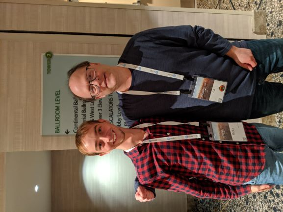

# What makes me a good fit {#fit}

Here are some of the things I believe make me a great fit for the internship:

## I `r emo::ji("heart")` .Rmd files

I was completely blown away by the R Markdown file format when I first discovered it, and I definitely felt a bit cheated by the fact that none of the courses I took during my undergrad in R mentioned it at all or the tidyverse. I have spent a lot of my time learning R Markdown and digging through books and amazing resources made available by RStudio, so here are some of my favorite formats that I would love to make more content around and teach people about:


### Learnr {#learnr}

<!-- I first discovered the ***learnr*** [@R-learnr] package in late 2018 and was really impressed by the functionality it provides. My first real project using learnr was centered around teaching my young Italian cousins to program in R by allowing them to compare their Fortnite stats in real time to each other and the best players in the world, and be able to learn more about the game through working with data, for example finding the best weapon based on their damage and range. The GitHub repository associated with that project can be found here: https://github.com/ries9112/R-Tutorial (the apps themselves are down but the repo has some gifs illustrating the past functionality) -->

**I have been using learnr for about a year and a half, and recently I started to offer tutorials on my website using learnr where every time the tutorial is opened, users learn to program in R using data from the cryptocurrency markets that is never outdated by more than 1 hour:** 

(this takes about 45 seconds to load, give it more time if it's showing up blank)

```{r, echo=F}
knitr::include_app("https://predictcrypto.shinyapps.io/R_Basics/",
  height = "600px")
```

I post these on my website:
```{r, echo=F}
knitr::include_url("https://predictcrypto.com/tutorials",
  height = "600px")
```

I'm loving the integrated tutorials tab within RStudio in the 1.3 preview and I am working towards including these with my `PredictCrypto` package, which I talk more about and use in the [next section](#ideal-projects) of this document.


### Bookdown {#bookdown}

At one point I was very close to paying for a monthly subscription on gitbook.com because I thought it was such an amazing format to provide documentation through, so I was particularly impressed by and grateful for the bookdown [@R-bookdown] package, and these days it's my go to for organizing most things I work on, so why not my application?

This document is obviously an example of a bookdown document in itself, but here's another guide I put together using bookdown:

```{r, echo=F}
knitr::include_url("https://predictcryptodb-quickstart.com/")
```

*MAKE SURE THIS ACTUALLY REFRESHES WITH GITHUB ACTIONS BEFORE APPLYING*

I also found that documentation done in bookdown can work really great when working within a large company as well, and I put together some very thorough documentation for a project using bookdown that was very well received (but I can't show here). In my particular case it worked really well because I could send the link to the html index of the bookdown document and when opened it would behave like a website hosted on the shared folders within the secure network which ended up being particularly simple and effective.


### Presentations {#presentations}

I am a **big** fan of ioslides and revealjs in particular as R Markdown outputs. I find the revealjs output to be incredibly cool with the rotating cube animation, and the ability to not only move forward but move downward adds a surprisingly useful tool to break down topics; ioslides is just really clean, well made and easy to use and looks great with widescreen enabled. I aspire to be an expert in Xaringan one day but am not currently.

Making presentations in R Markdown is what really got me working with .Rmd files, because I started working towards a very specific project using an idea I haven't really seen elsewhere of creating presentations that give the user options and as they make their way through the slides, those options affect not only what they see in the slides that come afterwards, but also the options they are given. For example, the user could choose to do an analysis for a particular asset, then choose the main category of the analysis to perform, then the sub-category of the analysis and so on, until by the end of the presentation the user has performed an analysis that was completely unique and tailored to their preferences and interests. See the gif below for an example of what this looks like:


### Blogdown {#blogdown}

Blogdown[@R-blogdown] and bookdown work very similarly, so most of what I mentioned in the [bookdown section](#bookdown) applies here. Because my website predictcrypto.com only shows the latest data based on the current date, I leverage blogdown to create weekly snapshots of the visualizations over the last 7 day period: https://predictcryptoblog.com/. 

```{r, echo=F}
knitr::include_url("https://predictcryptoblog.com/")
```

Because all these systems work so well with automation, as I keep adding new interesting content to my website I can also add archives of that content using blogdown.

### Pagedown {#pagedown}

Pagedown[@R-pagedown] is yet another awesome way to create html outputs and I used Nick Strayer's repository https://github.com/nstrayer/cv to build my cv and resume using his template:

```{r, echo=F}
knitr::include_url("https://ricky-cv.netlify.com/")
```


### Flexdashboard {#flexdashboard}

Flexdashboards[@R-flexdashboard] were my first introduction to shiny apps and I was completely blown away by that framework and have used it for several projects and is one of my absolute favorite tools.

To get some practice, I converted some of the content found in [Tidy Text Mining by Julia Silge and David Robinson](https://www.tidytextmining.com/) and made it into a flexdashboard. I made no changes to the code found within the book, this was simply an experiment to learn more about flexdashboards and semantic analysis:

```{r, echo=F}
knitr::include_url("https://predictcrypto.shinyapps.io/SemanticAnalysisExample/")
```

I made the code available through RStudio Cloud here as well: https://rstudio.cloud/spaces/9369/join?access_code=pkfhGuOMRhleNIHSHH6YOQPEWstEdg0e7Pi6Ue3q


## Automation {#automation}

Automation is at the center of everything I do and my one true passion. One of my big goals for RStudio::conf 2020 was to learn more about automating things through GitHub using CI since I always had a hard time figuring that out, and the things I learned about especially relating to GitHub actions and using Netlify were above my expectations in terms of the ease of use, capabilities and free tier offerings, and I am super excited to share how crazy simple automating a very complex process can be through RStudio, GitHub Actions and Netlify. 

The bookdown example from earlier https://predictcryptodb-quickstart.com/ for example uses those tools to refresh the guide daily in order to show the latest data in the [*useful tables* section](https://predictcryptodb-quickstart.com/useful-tables.html)

It's pretty mindblowing that these frameworks allow a user to create an interactive book with complex javascript, HTML, CSS, TeX, etc... from scratch, deploy it to an https secured website and create an automated process around it, all in less than 10 minutes with minimal code involved. What's even more mindblowing, is that the same methodologies can be applied to make other interfaces, like making a blogdown website, and I can't speak highly enough of all the work Yihui blessed us all with.


## Fit Within the Company {#rstudio}

I really wanted to go to RStudio::conf 2019 but was not able to make it out and after all the videos got posted I watched most of them and immediately knew I had to come to RStudio::conf 2020 and it was a truly incredible experience.

JJ's talk and BCorp announcement really resonated with me and there is no other company who's mission I agree with more and I would always do my very best in carrying forward those values. I fundamentally believe the most straightforward way to success is to help other people succeed, and I love the values that RStudio holds dear as a company and there is really no other company that I want to work for more than RStudio.


<!-- I'm a big fan of the RStudio internship program. I applied last year too, and it was really awesome seeing Maya do such a great job on her tidyblocks project  -->


<!-- I tried really hard to not be too much of a fanboy at the conference, but I couldn't help but get a picture with JJ and Hadley.  -->

<!--  -->

<!--  -->


<!-- Would have loved one with Yihui as well, so I will try and get one with him at next year's conference if I get the chance -->


