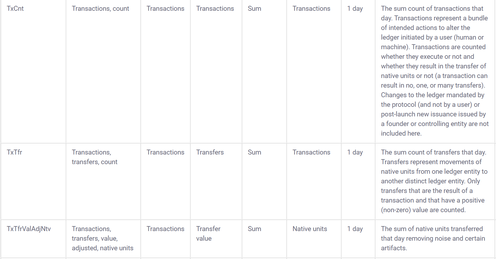

# Projects Well Suited For {#ideal-projects}


## Create resources for people working with spreadsheets in R


What better way to show I am suited for a project than to give a hands-on example? See the code below for a use-case using `googlesheets4`[@R-googlesheets4]. 

First I will go ahead and import every package in the `tidyverse`[@R-tidyverse]:
```{r import_tidyverse, message=FALSE, warning=FALSE}
library(tidyverse)
```

We will be importing the following spreadsheet:

```{r echo=F}
knitr::include_url("https://docs.google.com/spreadsheets/d/e/2PACX-1vR7fM5r89Jdxn3K-oLYTCWg2BsxQ_afQ21HNIJQIQIn7RqIJKJ_VLslSh1a4A4D2BBpPt2QYxSNiFdl/pubhtml?gid=1164062226&single=true")
```

```{r spreadsheet_url}
spreadsheet_url <- "https://docs.google.com/spreadsheets/d/1_zRBFrB1au7qhxuDDfDuh_bPLGd6RLrwOL5oQ3sBBX4/edit?usp=sharing"
```

Before importing the data, let's use `tictoc` [@R-tictoc] to measure how long each step takes. I am using `tic()` to start the time for both the total execution time and for the step reading the data in. After importing the data we will run `toc()` to get the execution time for that step.

```{r tic_start}
library(tictoc)
tic('Total runtime')
tic('Read googlesheets data')
```


Now let's import the `googlesheets4` and read a spreadsheet I made for this internship application, specifying the sheet called *coinmetrics_full* inside the function `read_sheet()`:

```{r import_coinmetrics_full, message=FALSE, warning=FALSE}
library(googlesheets4)
googlesheets_data <- read_sheet(spreadsheet_url, sheet = 'coinmetrics_full') %>% as.data.frame()
```


```{r tic_sheets_end}
toc()
```


<!-- ```{r show_import_coinmetrics_full, echo=F, message=FALSE, warning=FALSE} -->
<!-- library(flair) -->
<!-- decorate('import_coinmetrics_full') %>% -->
<!--   flair("coinmetrics_full") -->
<!-- ``` -->

<!-- *Using the `flair` [@R-flair] package for highlighting* -->


Let's take a peek at the first 1,000 rows using `DT::datatable()` [@R-DT]
```{r show_googlesheets_data, message=FALSE, warning=FALSE}
library(DT)
datatable(head(googlesheets_data,1000),  style = "default", 
          options = list(scrollX = TRUE, pageLength=5,dom='t'), rownames = F)
```

**This data is sourced from the website [coinmetrics.io](https://coinmetrics.io/community-network-data/#comm-files)**

How many rows in the dataset?
```{r count_rows}
nrow(googlesheets_data)
```


[Coinmetrics also provides a data dictionary to go along with the data:](https://coinmetrics.io/community-data-dictionary/)





## Build interactive learnr tutorials for tidymodels

### Data Prep

Using the data from coinmetrics, I will create a predictive model to forecast the percentage change in price over time.


First, I will import a package that I am making that is **still in development** `PredictCrypto`:

```{r library_predict_crypto}
library(PredictCrypto)
```
(this is an in-development tool that I will use for a research paper I am working on)

I attended the two day building tidy tools workshop working with Charlotte and Hadley at RStudio::conf 2020 and I am comfortable writing packages in R as well as using testthat and showing code coverage for a repository.

Here is the GitHub Pages environment associated with the repository:

```{r show_github_pages, echo=F}
knitr::include_url("https://ries9112.github.io/PredictCrypto/")
```

I am going to convert the column names from ***CamelCase*** to ***snake_case*** using the `janitor`[@R-janitor] package because the functions in my package use snake_case and I want to avoid mixing the two:  

Before:
```{r print_before_colnames, echo=F}
colnames(googlesheets_data)
```

```{r janitor_clean_names, message=FALSE, warning=FALSE}
library(janitor)
googlesheets_data <- clean_names(googlesheets_data)
```

After:
```{r print_after_colnames, echo=F}
colnames(googlesheets_data)
```


Now that I imported the `PredictCrypto` package and the data is in snake_case, I can use the function `calculate_percent_change()` to create the target variable to predict. Before I can do that however, I need one more adjustment to the date/time fields, so let's do that using the `anytime`[@R-anytime] package:

```{r conversions_anytime}
library(anytime)
googlesheets_data$date <- anytime(googlesheets_data$date)
googlesheets_data$date_time_utc <- anytime(googlesheets_data$date_time_utc)
```


Now I can use the function `calculate_percent_change()` to calculate the % change of the price of each cryptocurrency and add a new column ***target_percent_change*** to each row, which will represent the percentage change in price for the 7 day period that came after that data point was collected:
```{r calculate_percent_change_function, warning=FALSE}
exercise_data <- PredictCrypto::calculate_percent_change(googlesheets_data, 7, 'days')
```

Let's take a peek at the new field:
```{r}
tail(exercise_data$target_percent_change, 10)
```

I could easily change this to a 14 day period:

```{r target_14d}
calculate_percent_change(googlesheets_data, 14, 'days') %>% tail(10) %>% select(target_percent_change)
```

Or a 24 hour period:

```{r target_24h}
calculate_percent_change(googlesheets_data, 24, 'hours') %>% tail(10) %>% select(target_percent_change)
```

<!-- 
note to self: taking the tail here because of join exclusion and sorting which would compare different data points using head() 
-->


***Disclaimer:*** **Most of the code to follow was built using the content made available by Allison Hill from the RStudio::conf2020 intro to machine learning workshop and was not code I was familiar with before writing it for this internship application:**

https://education.rstudio.com/blog/2020/02/conf20-intro-ml/

https://conf20-intro-ml.netlify.com/materials/01-predicting/


### Feature scaling

Before getting started on the predictive modeling section, it's a good idea for us to scale the numeric data in our dataset. Some of the fields in the dataset are bound to have dramatically different ranges in their values:
```{r mean_roi_30_days}
mean(exercise_data$roi_30_days)
```

```{r mean_supply_current}
mean(exercise_data$supply_current)
```

This can be problematic for some models (not every model has this issue), and the difference in the magnitude of the numbers could unfairly influence the model to think that the variable with the larger numbers is more statistically important than the one with the lesser values when that might not actually be true.

For feature scaling, we need to do two things:

1. ***Center*** the data in every column to have a mean of zero

2. ***Scale*** the data in every column to have a standard deviation of one


The `recipes` [@R-recipes] package is a very useful package for pre-processing data before doing predictive modeling, and it allows us to center the way we do our data engineering around the independent variable we are looking to predict, which in our case is the `target_percent_change`. We can make a recipe which centers all numeric fields in the data using `step_center()` and then scale them using `step_scale()`. We will also remove the symbol column from the recipe using `step_rm()` because we don't want to use it for the predictions but we don't want to remove it from the dataset either:

```{r create_recipe, message=FALSE, warning=FALSE}
library(recipes)
scaling_recipe <- recipe(target_percent_change ~ ., data = exercise_data) %>%
  step_rm('symbol') %>% 
  step_center(all_numeric()) %>% 
  step_scale(all_numeric())
```

We can also take this as an opportunity to make some more adjustments that we will need later on. First we convert nominal data to numeric dummy variables using `step_dummy()`. Then we use `step_novel()`, which adds a catch-all level to factors to avoid an error we could run into predicting new levels in the test set (if a factor level has not been seen our code would fail otherwise). The final adjustment we will have in our recipe will use `step_zv()` to intelligently handle cases where a variable only contains a single value, which could also cause some issues in the later steps.

```{r add_to_recipe}
scaling_recipe <- scaling_recipe %>%
  step_novel(all_nominal()) %>%
  step_dummy(all_nominal()) %>%
  step_zv(all_predictors())
```


Now that we have made a data pre-processing *recipe*, let's map it to the `exercise_data` dataset:
```{r prep_recipe}
crypto_data_scaled <- scaling_recipe %>% prep(exercise_data) 
crypto_data_scaled
```

Now let's use `bake()` to put the old dataset in the oven and get back the scaled data `r emo::ji('cake')`:
```{r bake_scaled_data, warning=FALSE}
crypto_data_scaled <- crypto_data_scaled %>% bake(exercise_data)
```

Now the values are scaled:
```{r active_addresses_preview}
head(crypto_data_scaled$active_addresses,5)
```


You can see the difference from the previous values:
```{r scaled_active_addresses_preview}
head(exercise_data$active_addresses,5)
```


### Predictive Modeling


Create the `parsnip` [@R-parsnip] model

```{r parsnip models}
library(parsnip)
lm_model <- linear_reg() %>%              
  set_engine("lm") %>%             
  set_mode("regression")
```

List of models to refer to: https://tidymodels.github.io/parsnip/articles/articles/Models.html

Random Forest:
```{r random_forest_parsnip}
random_forest_model <- rand_forest(trees = 100, mode = "regression") %>%
  set_engine("randomForest") 
```


XGBoost:
```{r xgboost_parsnip}
xgboost_model <- xgboost_parsnip <- boost_tree() %>% 
  set_engine("xgboost") %>%             
  set_mode("regression")
```

Remove fields not used for models (NOTE: REMOVE price_usd_x_daysLater AND date_time_x_days_Later FROM BEING GENERATED INSIDE THE FUNCTION)

```{r remove_fields}
exercise_data <- select(exercise_data, -date_time_utc, -date_time, -pkDummy, -pkey, -price_usd_x_daysLater, -date_time_x_daysLater)
```


Create train/test split using `rsample`[@R-rsample]:

(should I do 10-fold cross validation?)
```{r train_test_split}
library(rsample)

set.seed(250)
crypto_data <- initial_split(exercise_data, prop = 0.8)
crypto_train <- training(crypto_data)
crypto_test  <-  testing(crypto_data)
```


### Train/fit the model:

```{r}
library(modelr)
lm_fitted <- lm_model %>% fit(target_percent_change ~ . -symbol, data=crypto_train) # fit price_usd to all variables except for the symbol
```

Random Forest:
```{r}
random_forest_fitted <- random_forest_model %>%
  fit(target_percent_change ~ . -symbol, data = crypto_train)
```


XGBoost:

```{r}
xgboost_fitted <- xgboost_model %>% fit(price_usd ~ . -symbol, data=crypto_train)
```


Use the trained model to make predictions on test data:

```{r}
library(tidymodels)
#crypto_test <- crypto_test %>% select(-symbol)
lm_predictions <- predict(lm_fitted, crypto_test)
```

<!-- ```{r} -->
<!-- random_forest_predictions <- random_forest_fitted %>% predict(crypto_test) -->
<!-- ``` -->

```{r message=FALSE, warning=FALSE}
xgboost_predictions <- xgboost_fitted %>% predict(crypto_test)
```

Join the full dataset back to the predictions:

```{r}
lm_predictions <- lm_predictions %>% bind_cols(crypto_test)

xgboost_predictions <- xgboost_predictions %>% bind_cols(crypto_test)
```


Get metrics:
```{r}
lm_predictions %>%
  metrics(truth = target_percent_change, estimate = .pred)

xgboost_predictions %>%
  metrics(truth = target_percent_change, estimate = .pred)
```


### Now make one model for each cryptocurrency. 

***Code adapted from: https://r4ds.had.co.nz/many-models.html***

First I group the data

```{r group_nest_data}
crypto_data_grouped <- exercise_data %>% group_by(symbol) %>% nest()
```

```{r show_grouped_nested_data}
crypto_data_grouped
```

Make a helper function with the model so I can make the `lm()` model using `purrr`:

```{r modelFunction}
grouped_linear_model <- function(df) {
  lm(target_percent_change ~ ., data = df)
}
```

Now we can use `purrr`[@R-purrr] to apply the model to each element of the grouped dataframe:
```{r}
grouped_models <- map(crypto_data_grouped$data, grouped_linear_model)
```


The models can be added into the dataframe as nested lists. We can also add the corresponding residuals:
```{r message=FALSE, warning=FALSE}
crypto_data_grouped <- crypto_data_grouped %>% 
  mutate(model=map(data,grouped_linear_model)) %>% 
  mutate(resids = map2(data, model, add_residuals))
```

Let's look at the object again:
```{r}
crypto_data_grouped
```


Let's unnest the residuals to take a closer look:

```{r}
resids <- unnest(crypto_data_grouped, resids)
```

```{r message=FALSE, warning=FALSE}
resids %>% 
  ggplot(aes(date, resid)) +
    geom_line(aes(group = symbol), alpha = 1 / 3) + 
    geom_smooth(se = FALSE) +
    ylim(c(-20,20)) +
    facet_wrap(~symbol)
```

### Add error metrics using `broom` [@R-broom]:

```{r broom_metrics_all}
crypto_models_metrics <- crypto_data_grouped %>% mutate(metrics=map(model,broom::glance)) %>% unnest(metrics)
```


Sort by the best scores:
```{r}
crypto_models_metrics %>% arrange(-r.squared)
```


### How much better do the models get if we add more variables?

Add MA, EMA, etc...


### Next Steps:

I won't go further than this here, but as my next steps, here is what I would do:

1. Use parsnip + purrr to iterate through lots of predictive models

2. How much better do the models get with hyperparameter tuning?

3. Visualize the best model before and after parameter tuning and then do the same with the worst performing model


^Change to "if I were to keep going" and add note about doing cross validation


<!-- Could also use `yardstick` [@R-yardstick] for metrics: https://tidymodels.github.io/yardstick/ -->

<!-- ```{r} -->
<!-- library(yardstick) -->
<!-- metrics(lm_predictions, target_percent_change,  estimate = .pred) -->
<!-- ``` -->


## Build interactive learnr tutorials for Python using reticulate

I think I could be a great fit for the third project listed related to creating learnr tutorials for Python using reticulate. I have a fair amount of experience in Python, but it's never really clicked very much for as much as R in the past, and I am looking to step-up my Python skills. My Master's in Data Science will work with Python a lot, and people immediately ask if I make tutorials in Python when I show them the R tutorials I have made, so this would be a great one for me to work on. I am also constantly told that Python is better than R for the incorrect reasons, and being more of an expert in Python would certainly help me debunk that myth when someone makes that argument.

I am very familiar with the `reticulate` package and I have used it in the past in an RMarkdown file to make automated cryptocurrency trades through a Python package `shrimpy-python`, which worked really well: https://github.com/shrimpy-dev/shrimpy-python

Since I have already demonstrated my familiarity with learnr tutorials **[in the previous section](#learnr)**, I will keep going with the code from the tidymodels project example I just finished and use Python for ... ADD GOAL HERE ...


DEV:

Replace this with the Python one:

<!-- ```{r} -->
<!-- knitr::include_app("https://predictcrypto.shinyapps.io/R_Basics/") -->
<!-- ``` -->

Could make a very simple xgboost model maybe?

Could also show using Shrimpy API to pull latest data, manipulate in pandas and visualize

Mention experience/courses taken in Python and how it's never clicked with me very much but how I am taking a basic Python course in my Master's in Data Science and I am looking to take it as an opportunity to create a lot of content using reticulate.

```{r import_reticulate}
library(reticulate)
```

```{python}

```


Return the total runtime of all of the examples above:


```{r tic_all_exercises_end}
toc()
```


