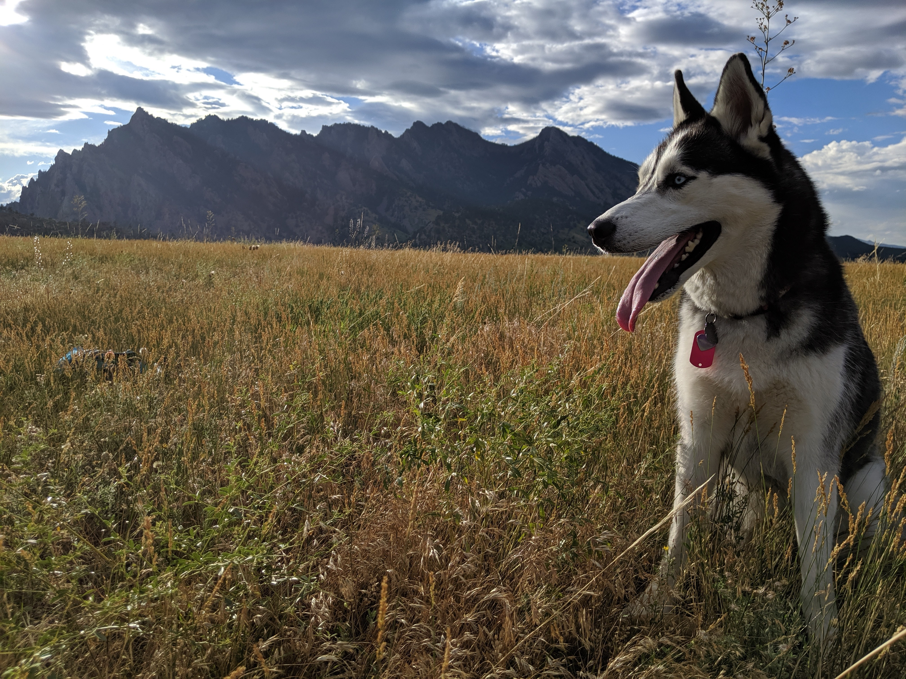
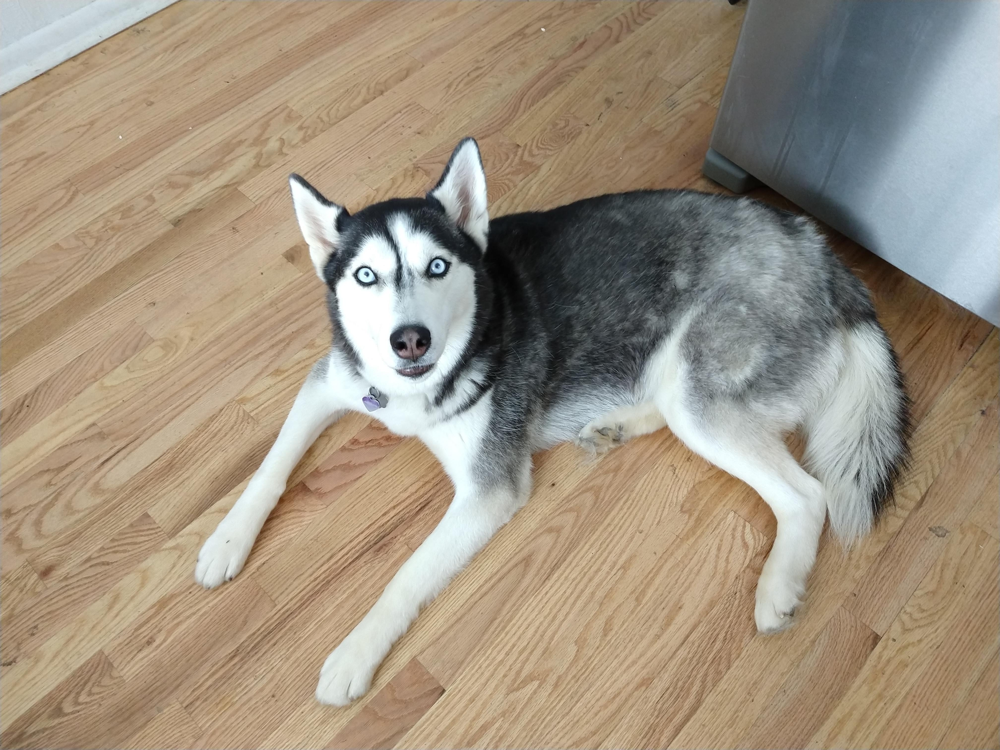

# About Me

My formal education is more oriented towards business, but during my time in college I tried to focus on learning tangible skills as much as possible, and computer science/programming started becoming more my niche over time vs. business. I am working towards a Master's in Data Science at the University of Denver and I live in Boulder, Colorado.

I was born and raised in Milan, Italy and moved to the middle of Manhattan with my American mom when I was 16 where I finished highschool. I ended up coming to Boulder after reading a [book about ultra marathon running](http://www.scottjurek.com/eat-run) and I could really see myself living in Boulder running with a husky dog training for ultra marathons, so that's what I did:



I also have an adorable little ferret called Percy:

<video width="320" height="240" controls>
  <source src="images/percy_video.mp4" type="video/mp4">
</video>


Is Sakura picture option 2 better? 


I spent my time as an undergrad at the University of Colorado, Boulder studying information management and being a part of the [CU Triathlon club team](https://www.cutriathlon.com/). As a Junior at CU I was one of the TA's for MGMT 3200 (Business Analytics) after ***really*** enjoying the course, which used Alteryx for doing ETL work, and a tool called [DataRobot](https://www.datarobot.com/) for making predictions. The grade obtained by students in the class was strongly impacted by their team's percentile ranking on the leaderboards of real [Kaggle](https://www.kaggle.com/) competitions that were going on at the time, and I found myself really loving working with data and I have been trying to learn as much as I can about anything and everything relating to data science since then. I spent multiple summers locking myself 40+ hours a week in my office working on just that.

Here are some of the online courses I worked my way through:

- https://resclapon.com/datacamp-certificates

- https://resclapon.com/udemy-certificates


Here is my resume with the same online learning certificates added:

```{r}
knitr::include_url("https://ricky-cv.netlify.com/")
```

In my senior year at CU Boulder, I did a business analytics internship with the Pricing Analytics team at Vail Resorts, which turned out to be a lot of manual work that should have been automated, so that's what I did. After graduating from CU Boulder I spent some time applying the things I learned around automation and web scraping to setup a project to collect data relating to the cryptocurrency markets from several sources because I had been trading on them since early 2014 and I saw an opportunity for some automated trading, and I wanted to have a personal project that I could work on over a longer period of time and use to get more comfortable in tools like SQL, R and Python with the prospect of making some money in the end. After a year and a half of working on this, I realized that I was actually better off opening up my project to others more and using it as a tool to teach others to program and that could be really valuable in my career progression towards eventually being a competent data scientist rather than spending all of my energy trying to make short-term trades, which doesn't really teach any tangible or useful skills outside of its own domain. The tutorials and lessons I am building specifically around this project can be found on https://predictcrypto.org/.

Today I am working towards a master's in Data Science part-time online and working on creating more research (including a more legitimate research paper with two professors) around the *PredictCrypto* project, and working on putting out more [tutorials and content through a YouTube channel](https://www.youtube.com/channel/UCZKbm8LERZBe_hwJNwroCPg?view_as=subscriber). My master's program allows me to take one course at a time, be a full-time student, or do anything in between, so that flexibility allows me to work full-time without having an overwhelming schedule.


