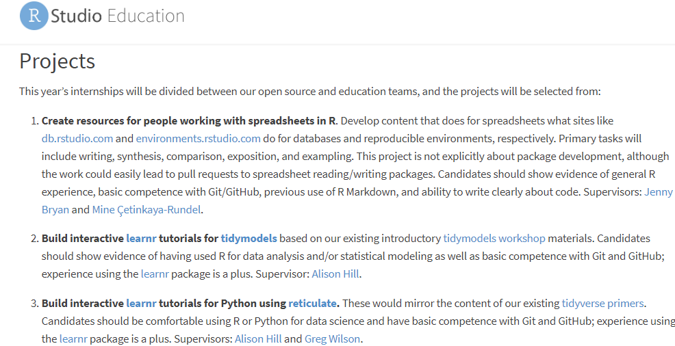

# Projects Well Suited For




## Create resources for people working with spreadsheets in R

Here make a guide using github environments making a repo. Maybe a learnr tutorial?

Also put some code here:

```{r message=FALSE, warning=FALSE}
library(googlesheets4)
practice_sheet <- read_sheet("https://docs.google.com/spreadsheets/d/1_zRBFrB1au7qhxuDDfDuh_bPLGd6RLrwOL5oQ3sBBX4")
practice_sheet
```

```{r}
library(data.table)
data.table(practice_sheet)
```


COULD MAKE THIS FIRST SECTION FROM GOOGLE SHEETS USING DATA ACTUALLY PREDICTING % CHANGE AND WHATNOT IF I LOAD THAT OTHER DATA INTO HERE. COULD THEN WORK ON NEXT SECTION WHILE MAKING PROGRESS ON BOTH INTERNSHIP AND RESEARCH PAPER!


## Build interactive learnr tutorials for tidymodels

https://education.rstudio.com/blog/2020/02/conf20-intro-ml/

https://conf20-intro-ml.netlify.com/materials/01-predicting/


## Build interactive learnr tutorials for Python using reticulate


Replace this with the Python one:

<!-- ```{r} -->
<!-- knitr::include_app("https://predictcrypto.shinyapps.io/R_Basics/") -->
<!-- ``` -->

Could make a very simple xgboost model maybe?


