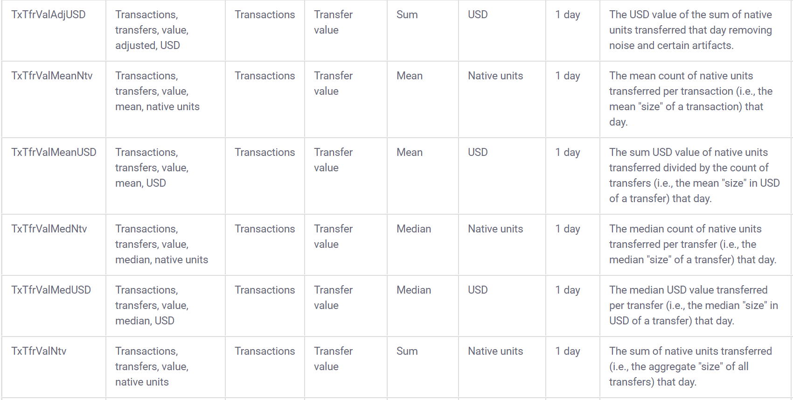

--- 
title: "RStudio 2020 Internship Application"
author: "Riccardo Esclapon"
site: bookdown::bookdown_site
documentclass: book
bibliography: [book.bib, packages.bib]
biblio-style: apalike
link-citations: yes
description: "This is Ricky's application to the 2020 RStudio Internship."
---


# Overview

Video intro here


https://education.rstudio.com/blog/2020/02/applications-for-2020-intern-program-are-now-open/

APPLICATIONS END ON MARCH 5TH BE SURE TO APPLY BEFORE THEN!!

For video:

Start off by going over the "Why Me" section and talk about ways I have applied the broad RMarkdown ecosystem and automation to my work. Then go to the projects suited for section to give an overview of what makes me a good fit for the first three projects specifically and examples I started to work on for each. Then give intro to about me and ideal tutorial sections. End things with a cool charts/visualizations section (or include in projects suited for section)

Start off with overview of projects I am suited for showing work I did for this application specifically. Then go on to talk about ways I have applied the broad RMarkdown ecosystem and automation in my work. Then talk a bit more about myself. Talk about ideal tutorial overview and close things by mentioning cool charts/visualizations section (outline this at a high level under 2 minutes in the video at the start here)


```{r include=FALSE}
library(bibtex)
# automatically create a bib database for R packages
knitr::write_bib(c(
  .packages(), "bookdown", "knitr", "rmarkdown", "tidyverse", "plotly", "rayshader"
), "packages.bib")
```

<!--chapter:end:index.Rmd-->

# What makes me a good fit {#fit}

Here are some of the things I believe make me a great fit for the internship:

## I `r emo::ji("heart")` .Rmd files

I was completely blown away by the R Markdown file format when I first discovered it, and I definitely felt like the courses I took in college in R should have mentioned the .Rmd format, as well as the tidyverse and the idea behind the pipe operator. I have spent a lot of my time learning R Markdown and digging through books and amazing resources made available by RStudio, so here are some of my favorite output formats that I am looking to teach people about:


### Learnr {#learnr}

<!-- I first discovered the ***learnr*** [@R-learnr] package in late 2018 and was really impressed by the functionality it provides. My first real project using learnr was centered around teaching my young Italian cousins to program in R by allowing them to compare their Fortnite stats in real time to each other and the best players in the world, and be able to learn more about the game through working with data, for example finding the best weapon based on their damage and range. The GitHub repository associated with that project can be found here: https://github.com/ries9112/R-Tutorial (the apps themselves are down but the repo has some gifs illustrating the past functionality) -->

I have been using learnr [for about a year and a half](https://github.com/ries9112/R-Tutorial), and recently I started to offer programming tutorials on my website using learnr where every time the tutorial is opened, users learn to program in R using data from the cryptocurrency markets that is never outdated by more than 1 hour:

(this takes about 30 seconds to load, give it more time if it's showing up blank)

```{r echo=F}
knitr::include_app("https://predictcrypto.shinyapps.io/R_Basics/",
  height = "612E00px")
```

I would recommend looking at the **Visualization** section to visually see that the data is never outdated by more than 1 hour.

I post these on my website:
```{r, echo=F}
knitr::include_url("https://predictcrypto.com/tutorials",
  height = "600px")
```

I'm loving the integrated tutorials tab within RStudio in the 1.3 preview and I am working towards including these with my `PredictCrypto` package, which I talk more about and use in the [next section](#ideal-projects) of this document.


### Bookdown {#bookdown}

I was very close to paying for a monthly subscription on gitbook.com because I thought it was such an amazing format to provide documentation through, so I was particularly impressed by and grateful for the bookdown [@R-bookdown] package, and these days it's my go to for organizing most things I work on, so why not my application?

This document is obviously an example of a bookdown document in itself, but here's another guide I put together using bookdown:

```{r echo=F}
knitr::include_url("https://predictcryptodb-quickstart.com/")
```

This guide refreshes daily in order to show a preview of the latest data within the document [and you can look at the GitHub Actions daily runs here](https://github.com/ries9112/PredictCryptoDB/actions). You can also see the refreshed data in the [*useful tables* section](https://predictcryptodb-quickstart.com/useful-tables.html) of the document.

I also found that documentation done in bookdown can work really great when working within a large company as well, and I put together some very thorough documentation for a project using bookdown that was very well received (but I can't show here). In my particular case it worked really well because I could send the link to the html index of the bookdown document and when opened it would behave like a website hosted on the shared folders within the secure network which ended up being particularly simple and effective.


### Presentations {#presentations}

I am a **big** fan of ioslides and revealjs in particular as R Markdown outputs. I find the revealjs output to be incredibly cool with the rotating cube animation, and the ability to not only move forward but move downward adds a surprisingly useful tool to break down topics; ioslides is just really clean, well made and easy to use and looks great with widescreen enabled. I aspire to be an expert in Xaringan one day but am not currently.

Making presentations in R Markdown is what really got me working with .Rmd files, because I started working towards a very specific project using an idea I haven't really seen elsewhere of creating presentations that give the user options and as they make their way through the slides, those options affect not only what they see in the slides that come afterwards, but also the options they are given. For example, the user could choose to do an analysis for a particular asset, then choose the main category of the analysis to perform, then the sub-category of the analysis and so on, until by the end of the presentation the user has performed an analysis that was completely unique and tailored to their preferences and interests. See the gif below for an example of what this looks like:

<!--  -->


### Blogdown {#blogdown}

Blogdown[@R-blogdown] and bookdown work very similarly, so most of what I mentioned in the [bookdown section](#bookdown) applies here. Because my website predictcrypto.com only shows the latest data based on the current date, I leverage blogdown to create weekly snapshots of the visualizations over the last 7 day period: https://predictcryptoblog.com/. 

```{r show_blog, echo=F}
knitr::include_url("https://predictcryptoblog.com/")
```

Because all these systems work so well with automation, as I keep adding new interesting content to my website I can also add archives of that content using blogdown.

### Pagedown {#pagedown}

Pagedown[@R-pagedown] is yet another awesome way to create html outputs and I used Nick Strayer's repository https://github.com/nstrayer/cv to build my cv and resume using his template:

```{r show_resume, echo=F}
knitr::include_url("https://ricky-cv.netlify.com/resume")
```

*[Big thanks to Nick Strayer for the awesome template!](https://github.com/nstrayer/cv)*

### Flexdashboard {#flexdashboard}

Flexdashboards [@R-flexdashboard] were my first introduction to shiny apps and I was completely blown away by that framework and have used it for several projects and is one of my absolute favorite tools.

To get some practice, I converted some of the content found in [Tidy Text Mining by Julia Silge and David Robinson](https://www.tidytextmining.com/) and made it into a flexdashboard. **I made no changes to the code found within the book**, this was simply an experiment to learn more about flexdashboards and semantic analysis:

```{r, echo=F}
knitr::include_url("https://predictcrypto.shinyapps.io/SemanticAnalysisExample/")
```

<!-- I made the code available through RStudio Cloud here as well: https://rstudio.cloud/spaces/9369/join?access_code=pkfhGuOMRhleNIHSHH6YOQPEWstEdg0e7Pi6Ue3q -->


## Automation {#automation}

Automation is at the center of everything I do and my one true passion. One of my big goals for RStudio::conf 2020 was to learn more about automating things through GitHub using CI since I always had a hard time figuring that out, and the things I learned about especially relating to GitHub actions and using Netlify were above my expectations in terms of the ease of use, capabilities and free tier offerings, and I am super excited to share how crazy simple automating a very complex process can be through RStudio, GitHub Actions and Netlify. I didn't fnd a huge wealth of information on automating things in R through GitHub Actions and I'm excited to share those learnings in the months to come.

It's pretty mindblowing that these frameworks allow a user to create an interactive book with complex javascript, HTML, CSS, TeX, etc... from scratch, deploy it to an https secured website and create an automated process around it, all in less than 10 minutes with minimal code involved. What's even more powerful, is that the same methodologies can be applied to make other interfaces and outputs, like making a blogdown website, and I can't speak highly enough of all the work Yihui blessed us all with.

I have also done a lot of automation work for [Vail Resorts](https://www.google.com/search?q=vail+resorts+stock) using a tool called [Alteryx](https://www.alteryx.com/) to create fully automated processes with the main purpose of refreshing Tableau dashboards offering refreshed datasets relating to ski pass sales. You can find an example of an automated Alteryx process I created for a personal project doing automated trading on the cryptocurrency markets using my own database, SQL, R and Python here: https://community.alteryx.com/t5/Alteryx-Use-Cases/Predicting-and-Trading-on-the-Cryptocurrency-Markets-using/ta-p/494058


## Fit Within the Company {#rstudio}

I really wanted to go to RStudio::conf 2019 but was not able to make it out and after all the videos got posted I watched most of them and immediately knew I had to come to RStudio::conf 2020 and it was a truly incredible experience.

JJ's talk and BCorp announcement really resonated with me and there is no other company who's mission I agree with more and I would always do my very best in carrying forward those values. I fundamentally believe the most straightforward way to success is to help other people succeed, and I share the values that RStudio holds dear as a company and there is really no other company that I want to work for more than RStudio. At the conference one of the things I was really impressed with for example was the focus and clarity around why everything should always be reproducible and how not making your work publicly available can often be very costly in many different ways. RStudio has done an **incredible** job at making incredible powerful and complex frameworks easy for anyone to use, and there's nothing I would rather do more than contribute to making easy to follow and informative content to help other *"fellow self-taught programmers who were told they weren't good enough but are too driven and excited to care"* [@gans2020] in the same spirit of former superstar interns like Maya.


I also work my best remotely, I have a dedicated office to do my work in with a powerful desktop PC and two monitors. I also have experience working remotely and keeping myself accountable without someone looking over my shoulder.


<!-- I'm a big fan of the RStudio internship program. I applied last year too, and it was really awesome seeing Maya do such a great job on her tidyblocks project  -->


<!-- I tried really hard to not be too much of a fanboy at the conference, but I couldn't help but get a picture with JJ and Hadley.  -->

<!--  -->

<!--  -->


<!-- Would have loved one with Yihui as well, so I will try and get one with him at next year's conference if I get the chance -->


<!--chapter:end:01-WhyMe.Rmd-->

# Projects Well Suited For {#ideal-projects}


## Create resources for people working with spreadsheets in R


What better way to show I am suited for a project than to give a hands-on example? See the code below for a use-case using `googlesheets4`[@R-googlesheets4]. 

First I will go ahead and import every package in the `tidyverse`[@R-tidyverse]:
```{r import_tidyverse, message=FALSE, warning=FALSE}
library(tidyverse)
```

We will be importing the following spreadsheet:

```{r echo=F}
knitr::include_url("https://docs.google.com/spreadsheets/d/1_zRBFrB1au7qhxuDDfDuh_bPLGd6RLrwOL5oQ3sBBX4/edit?usp=sharing")
```

```{r spreadsheet_url}
spreadsheet_url <- "https://docs.google.com/spreadsheets/d/1_zRBFrB1au7qhxuDDfDuh_bPLGd6RLrwOL5oQ3sBBX4/edit?usp=sharing"
```

Before importing the data, let's use `tictoc` [@R-tictoc] to measure how long each step takes. I am using `tic()` to start the time for both the total execution time and for the step reading the data in. After importing the data we will run `toc()` to get the execution time for that step.

```{r tic_start}
library(tictoc)
tic('Total runtime')
tic('Read googlesheets data')
```


Now let's import the `googlesheets4` and read a spreadsheet I made for this internship application, specifying the sheet called *coinmetrics_full_new* inside the function `read_sheet()`:

```{r import_coinmetrics_full_new, message=FALSE, warning=FALSE}
library(googlesheets4)
googlesheets_data <- read_sheet(spreadsheet_url, sheet = 'coinmetrics_full_new') %>% as.data.frame()
```


```{r tic_sheets_end}
toc()
```


<!-- ```{r show_import_coinmetrics_full_new, echo=F, message=FALSE, warning=FALSE} -->
<!-- library(flair) -->
<!-- decorate('import_coinmetrics_full_new') %>% -->
<!--   flair("coinmetrics_full_new") -->
<!-- ``` -->

<!-- *Using the `flair` [@R-flair] package for highlighting* -->


Let's take a peek at the first 1,000 rows using `DT::datatable()` [@R-DT]
```{r show_googlesheets_data, message=FALSE, warning=FALSE}
library(DT)
datatable(head(googlesheets_data,1000),  style = "default", 
          options = list(scrollX = TRUE, pageLength=5,dom='t'), rownames = F)
```

**This data is sourced from the website [coinmetrics.io](https://coinmetrics.io/community-network-data/#comm-files)**

How many rows in the dataset?
```{r count_rows}
nrow(googlesheets_data)
```


[Coinmetrics also provides a data dictionary to go along with the data:](https://coinmetrics.io/community-data-dictionary/)





## Build interactive learnr tutorials for tidymodels

### Data Prep

Using the data from coinmetrics, I will create a predictive model to forecast the percentage change in price over time.


First, I will import a package that I am making that is **still in development** `PredictCrypto`:

```{r library_predict_crypto}
library(PredictCrypto)
```
(this is an in-development tool that I will use for a research paper I am working on)

I attended the two day building tidy tools workshop working with Charlotte and Hadley at RStudio::conf 2020 and I am comfortable writing packages in R as well as using testthat and showing code coverage for a repository.

Here is the GitHub Pages environment associated with the repository:

```{r show_github_pages, echo=F}
knitr::include_url("https://ries9112.github.io/PredictCrypto/")
```

I am going to convert the column names from ***CamelCase*** to ***snake_case*** using the `janitor`[@R-janitor] package because the functions in my package use snake_case and I want to avoid mixing the two:  

Before:
```{r print_before_colnames, echo=F}
colnames(googlesheets_data)
```

```{r janitor_clean_names, message=FALSE, warning=FALSE}
library(janitor)
googlesheets_data <- clean_names(googlesheets_data)
```

After:
```{r print_after_colnames, echo=F}
colnames(googlesheets_data)
```


Now that I imported the `PredictCrypto` package and the data is in snake_case, I can use the function `calculate_percent_change()` to create the target variable to predict. Before I can do that however, I need one more adjustment to the date/time fields, so let's do that using the `anytime`[@R-anytime] package:

```{r conversions_anytime}
library(anytime)
googlesheets_data$date <- anytime(googlesheets_data$date)
googlesheets_data$date_time_utc <- anytime(googlesheets_data$date_time_utc)
```


Now I can use the function `calculate_percent_change()` to calculate the % change of the price of each cryptocurrency and add a new column ***target_percent_change*** to each row, which will represent the percentage change in price for the 7 day period that came after that data point was collected:
```{r calculate_percent_change_function, warning=FALSE}
exercise_data <- PredictCrypto::calculate_percent_change(googlesheets_data, 7, 'days')
```

Let's take a peek at the new field:
```{r}
tail(exercise_data$target_percent_change, 10)
```

I could easily change this to a 14 day period:

```{r target_14d}
calculate_percent_change(googlesheets_data, 14, 'days') %>% tail(10) %>% select(target_percent_change)
```

Or a 24 hour period:

```{r target_24h}
calculate_percent_change(googlesheets_data, 24, 'hours') %>% tail(10) %>% select(target_percent_change)
```

<!-- 
note to self: taking the tail here because of join exclusion and sorting which would compare different data points using head() 
-->


***Disclaimer:*** **Most of the code to follow was built using the content made available by Allison Hill from the RStudio::conf2020 intro to machine learning workshop and was not code I was familiar with before writing it for this internship application:**

https://education.rstudio.com/blog/2020/02/conf20-intro-ml/

https://conf20-intro-ml.netlify.com/materials/01-predicting/


### Feature scaling

Before getting started on the predictive modeling section, it's a good idea for us to scale the numeric data in our dataset. Some of the fields in the dataset are bound to have dramatically different ranges in their values:
```{r mean_roi_30_days}
mean(exercise_data$roi_30_days)
```

```{r mean_supply_current}
mean(exercise_data$supply_current)
```

This can be problematic for some models (not every model has this issue), and the difference in the magnitude of the numbers could unfairly influence the model to think that the variable with the larger numbers is more statistically important than the one with the lesser values when that might not actually be true.

For feature scaling, we need to do two things:

1. ***Center*** the data in every column to have a mean of zero

2. ***Scale*** the data in every column to have a standard deviation of one


The `recipes` [@R-recipes] package is a very useful package for pre-processing data before doing predictive modeling, and it allows us to center the way we do our data engineering around the independent variable we are looking to predict, which in our case is the `target_percent_change`. We can make a recipe which centers all numeric fields in the data using `step_center()` and then scale them using `step_scale()`. We will also remove the symbol column from the recipe using `step_rm()` because we don't want to use it for the predictions but we don't want to remove it from the dataset either:

```{r tic_scaling}
tic('Scaling')
```


```{r create_recipe, message=FALSE, warning=FALSE}
library(recipes)
scaling_recipe <- recipe(target_percent_change ~ ., data = exercise_data) %>%
  step_rm('symbol') %>% 
  step_center(all_numeric()) %>% 
  step_scale(all_numeric())
```

We can also take this as an opportunity to make some more adjustments that we will need later on. First we convert nominal data to numeric dummy variables using `step_dummy()`. Then we use `step_novel()`, which adds a catch-all level to factors to avoid an error we could run into predicting new levels in the test set (if a factor level has not been seen our code would fail otherwise). The final adjustment we will have in our recipe will use `step_zv()` to intelligently handle cases where a variable only contains a single value, which could also cause some issues in the later steps.

```{r add_to_recipe}
scaling_recipe <- scaling_recipe %>%
  step_novel(all_nominal()) %>%
  step_dummy(all_nominal()) %>%
  step_zv(all_predictors())
```


Now that we have made a data pre-processing *recipe*, let's map it to the `exercise_data` dataset:
```{r prep_recipe}
crypto_data_scaled <- scaling_recipe %>% prep(exercise_data) 
crypto_data_scaled
```

Now let's use `bake()` to put the old dataset in the oven and get back the scaled data `r emo::ji('cake')`:
```{r bake_scaled_data, warning=FALSE}
crypto_data_scaled <- crypto_data_scaled %>% bake(exercise_data)
```

Now the values are scaled:
```{r active_addresses_preview}
head(crypto_data_scaled$active_addresses,5)
```


You can see the difference from the previous values:
```{r scaled_active_addresses_preview}
head(exercise_data$active_addresses,5)
```


```{r toc_scaling}
toc('Scaling')
```


### Predictive Modeling

```{r tic_predictive_modeling}
tic('Predictive Modeling')
```


Create the `parsnip` [@R-parsnip] model

```{r parsnip models}
library(parsnip)
lm_model <- linear_reg() %>%              
  set_engine("lm") %>%             
  set_mode("regression")
```

List of models to refer to: https://tidymodels.github.io/parsnip/articles/articles/Models.html

Random Forest:
```{r random_forest_parsnip}
random_forest_model <- rand_forest(trees = 100, mode = "regression") %>%
  set_engine("randomForest") 
```


XGBoost:
```{r xgboost_parsnip}
xgboost_model <- xgboost_parsnip <- boost_tree() %>% 
  set_engine("xgboost") %>%             
  set_mode("regression")
```

Remove fields not used for models (NOTE: REMOVE price_usd_x_daysLater AND date_time_x_days_Later FROM BEING GENERATED INSIDE THE FUNCTION)

```{r remove_fields}
exercise_data <- select(exercise_data, -date_time_utc, -date_time, -pkDummy, -pkey, -price_usd_x_daysLater, -date_time_x_daysLater)
```


Create train/test split using `rsample`[@R-rsample]:

(should I do 10-fold cross validation?)
```{r train_test_split}
library(rsample)

set.seed(250)
crypto_data <- initial_split(exercise_data, prop = 0.8)
crypto_train <- training(crypto_data)
crypto_test  <-  testing(crypto_data)
```


### Train/fit the model:


```{r}
library(modelr)
lm_fitted <- lm_model %>% fit(target_percent_change ~ . -symbol, data=crypto_train) # fit price_usd to all variables except for the symbol
```

Random Forest:

```{r tic_random_forest}
tic('Random Forest')
```

```{r}
random_forest_fitted <- random_forest_model %>%
  fit(target_percent_change ~ . -symbol, data = crypto_train)
```

```{r toc_random_forest}
toc('Random Forest')
```

XGBoost:

```{r tic_xgboost}
tic('XGBoost')
```

```{r}
xgboost_fitted <- xgboost_model %>% fit(price_usd ~ . -symbol, data=crypto_train)
```

```{r toc_xgboost}
toc('XGBoost')
```

Use the trained model to make predictions on test data:

```{r}
library(tidymodels)
#crypto_test <- crypto_test %>% select(-symbol)
lm_predictions <- predict(lm_fitted, crypto_test)
```

<!-- ```{r} -->
<!-- random_forest_predictions <- random_forest_fitted %>% predict(crypto_test) -->
<!-- ``` -->

```{r message=FALSE, warning=FALSE}
xgboost_predictions <- xgboost_fitted %>% predict(crypto_test)
```

Join the full dataset back to the predictions:

```{r}
lm_predictions <- lm_predictions %>% bind_cols(crypto_test)

xgboost_predictions <- xgboost_predictions %>% bind_cols(crypto_test)
```


Get metrics:
```{r}
lm_predictions %>%
  metrics(truth = target_percent_change, estimate = .pred)

xgboost_predictions %>%
  metrics(truth = target_percent_change, estimate = .pred)
```


### Now make one model for each cryptocurrency. 

***Code adapted from: https://r4ds.had.co.nz/many-models.html***

First I group the data

```{r group_nest_data}
crypto_data_grouped <- exercise_data %>% group_by(symbol) %>% nest()
```

```{r show_grouped_nested_data}
crypto_data_grouped
```

Make a helper function with the model so I can make the `lm()` model using `purrr`:

```{r modelFunction}
grouped_linear_model <- function(df) {
  lm(target_percent_change ~ ., data = df)
}
```

Now we can use `purrr`[@R-purrr] to apply the model to each element of the grouped dataframe:
```{r}
grouped_models <- map(crypto_data_grouped$data, grouped_linear_model)
```


The models can be added into the dataframe as nested lists. We can also add the corresponding residuals:
```{r message=FALSE, warning=FALSE}
crypto_data_grouped <- crypto_data_grouped %>% 
  mutate(model=map(data,grouped_linear_model)) %>% 
  mutate(resids = map2(data, model, add_residuals))
```

Let's look at the object again:
```{r}
crypto_data_grouped
```


Let's unnest the residuals to take a closer look:

```{r}
resids <- unnest(crypto_data_grouped, resids)
```

```{r message=FALSE, warning=FALSE}
resids %>% 
  ggplot(aes(date, resid)) +
    geom_line(aes(group = symbol), alpha = 1 / 3) + 
    geom_smooth(se = FALSE) +
    ylim(c(-20,20)) +
    facet_wrap(~symbol)
```

### Add error metrics using `broom` [@R-broom]:

```{r broom_metrics_all}
crypto_models_metrics <- crypto_data_grouped %>% mutate(metrics=map(model,broom::glance)) %>% unnest(metrics)
```


Sort by the best scores:
```{r}
crypto_models_metrics %>% arrange(-r.squared)
```


```{r toc_predictive_modeling}
toc('Predictive Modeling')
```


### How much better do the models get if we add more variables?

Add MA, EMA, etc...


### Next Steps:

I won't go further than this here, but as my next steps, here is what I would do:

1. Use parsnip + purrr to iterate through lots of predictive models

2. How much better do the models get with hyperparameter tuning?

3. Visualize the best model before and after parameter tuning and then do the same with the worst performing model


^Change to "if I were to keep going" and add note about doing cross validation


<!-- Could also use `yardstick` [@R-yardstick] for metrics: https://tidymodels.github.io/yardstick/ -->

<!-- ```{r} -->
<!-- library(yardstick) -->
<!-- metrics(lm_predictions, target_percent_change,  estimate = .pred) -->
<!-- ``` -->


## Build interactive learnr tutorials for Python using reticulate

I think I could be a great fit for the third project listed related to creating learnr tutorials for Python using reticulate. I have a fair amount of experience in Python, but it's never really clicked very much for as much as R in the past, and I am looking to step-up my Python skills. My Master's in Data Science will work with Python a lot, and people immediately ask if I make tutorials in Python when I show them the R tutorials I have made, so this would be a great one for me to work on. I am also constantly told that Python is better than R for the incorrect reasons, and being more of an expert in Python would certainly help me debunk that myth when someone makes that argument.

I am very familiar with the `reticulate` package and I have used it in the past in an RMarkdown file to make automated cryptocurrency trades through a Python package `shrimpy-python`, which worked really well: https://github.com/shrimpy-dev/shrimpy-python

Since I have already demonstrated my familiarity with learnr tutorials **[in the previous section](#learnr)**, I will keep going with the code from the tidymodels project example I just finished and use Python for ... ADD GOAL HERE ...


DEV:

Replace this with the Python one:

<!-- ```{r} -->
<!-- knitr::include_app("https://predictcrypto.shinyapps.io/R_Basics/") -->
<!-- ``` -->

Could make a very simple xgboost model maybe?

Could also show using Shrimpy API to pull latest data, manipulate in pandas and visualize

Mention experience/courses taken in Python and how it's never clicked with me very much but how I am taking a basic Python course in my Master's in Data Science and I am looking to take it as an opportunity to create a lot of content using reticulate.

```{r import_reticulate}
library(reticulate)
```

```{python}

```


Return the total runtime of all of the examples above:

```{r tic_all_exercises_end}
toc()
```


<!--chapter:end:02-ProjectsSuitedFor.Rmd-->

# About Me

My formal education is more oriented towards business, but during my time in college I tried to focus on learning tangible skills as much as possible, and computer science/programming started becoming more my niche over time vs. business. I am working towards a Master's in Data Science at the University of Denver and I live in Boulder, Colorado.

I was born and raised in Milan, Italy and moved to the middle of Manhattan with my American mom when I was 16 where I finished highschool. I ended up coming to Boulder after reading a [book about ultra marathon running](http://www.scottjurek.com/eat-run) and I could really see myself living in Boulder running with a husky dog training for ultra marathons, so that's what I did:


 

I also have an adorable little ferret:

 


I spent my time as an undergrad at the University of Colorado, Boulder studying information management and being a part of the [CU Triathlon club team](https://www.cutriathlon.com/). As a Junior at CU I was one of the TA's for MGMT 3200 (Business Analytics) after ***really*** enjoying the course, which used Alteryx for doing ETL work, and a tool called [DataRobot](https://www.datarobot.com/) for making predictions. The grade obtained by students in the class was strongly impacted by their team's percentile ranking on the leaderboards of real [Kaggle](https://www.kaggle.com/) competitions that were going on at the time, and I found myself really loving working with data and I have been trying to learn as much as I can about anything and everything relating to data science since then. I spent multiple summers locking myself 40+ hours a week in my office working on just that.

Here are some of the online courses I worked my way through:

- https://resclapon.com/datacamp-certificates

- https://resclapon.com/udemy-certificates


Here is my resume with the same online learning certificates added to it:

```{r, echo=F}
knitr::include_url("https://ricky-cv.netlify.com/")
```

*[Thanks again to Nick Strayer for the awesome template](https://github.com/nstrayer/cv)*

In my senior year at CU Boulder, I did a business analytics internship with the Pricing Analytics team at Vail Resorts, which turned out to be a lot of manual work that should have been automated, so that's what I did. After graduating from CU Boulder I spent some time applying the things I learned around automation and web scraping to setup a project to collect data relating to the cryptocurrency markets from several sources because I had been trading on them since early 2014 and I saw an opportunity for some automated trading, and I wanted to have a personal project that I could work on over a longer period of time and use to get more comfortable in tools like SQL, R and Python with the prospect of making some money in the end. After a year and a half of working on this, I realized that I was actually better off opening up my project to others more and using it as a tool to teach others to program and that could be really valuable in my career progression towards eventually being a competent data scientist rather than spending all of my energy trying to make short-term trades, which doesn't really teach any tangible or useful skills outside of its own domain. The tutorials and lessons I am building specifically around this project can be found on https://predictcrypto.org/.

Today I am working towards a master's in Data Science part-time online and working on creating more research (including a more legitimate research paper with two professors) around the *PredictCrypto* project, and working on putting out more [tutorials and content through a YouTube channel](https://www.youtube.com/channel/UCZKbm8LERZBe_hwJNwroCPg?view_as=subscriber). My master's program allows me to take one course at a time, be a full-time student, or do anything in between, so that flexibility allows me to work full-time without having an overwhelming schedule.


<!--chapter:end:03-AboutMe.Rmd-->

# Ideal Tutorial

## Overview 


I don't see this question on the last post regarding the RStudio internship applications being open through March 6th, but I have been thinking about this question since I saw it [originally posted here in November](https://education.rstudio.com/blog/2019/11/rstudio-internships-2020-preview/), so I wanted to include this answer in my application.

Ultimately I think analyzing cryptocurrencies is fun and interesting and a good way to get people's attention, but I have been thinking that a much more useful application of these ideas would be to be able to do a very similar thing but to create live data feeds from sensors out in the real world. This data could then be used to provide highly interactive programming tutorials, where the outcomes of the analysis would change based on the most recent data that was collected. To give a practical example of what that could look like, if there was a live data feed of sensors across Australia giving live information around particulates, carbon monoxide, ozone, carbon dioxide as well as other factors like informaton about the wind, etc.. it seems to me that this could empower things like early detection and much better prevention in general through predictive modeling and being able to triangulate the location of fires as they start or to figure out how to spread the limited resources across the different fires, and I just love the idea of the possibility of moving the needle on a problem through programming tutorials rather than working with uninteresting old data. Creating a system that allows people to actually contribute towards solving real problems might be wishful thinking, but I do believe that the best to teach someone these concepts is to give them data they care about and give them a realistic path forward to apply their existing intuition to answer questions they care about. The `mtcars` and `iris` datasets are great, but data feeds that change over time would be better in ***some*** cases in terms of getting a person invested in the actual analysis being done.

## Tutorials I Have Planned{#tutorials-planned}

As I was thinking through this question, I realized that beyond doing cool work around the data being used itself, I have a pretty lengthy list of topics that I feel are not always expressed as concisely as they should be. These topics *have* been covered by others in the past, but if I had a 5-10 minute video outlining things the way I plan on doing it, it would have saved me a lot of time, so hopefully even if I only reach a couple of people I will have saved them a lot of time, as well as myself whenever I want to go back to using **any of these tools:**

* Creating a website with bookdown, GitHub and Netlify.

    - Conceptually speaking this is amazingly simple to implement if you just know where to click in GitHub + RStudio and does things that would be pretty difficult to achieve with older tools.
    

* GitHub actions for automation

    - This is a pretty new topic because GitHub Actions have been very recently introduced and most resources online make this way overcomplicated and/or they are not usually specific to R. It's actually not that difficult though and it makes a ton of sense conceptually, especially when using `devtools::check()`, and is a general tool that can be used for all sorts of automation. In fact, it would be a terrible experience, but you could program in R without needing your own computer by using GitHub actions.
    
    - I was running into an issue I did not understand when using GitHub actions with bookdown files because of the default argument `clean_envir=FALSE` when running `render_book()`, and I documented the issue here: https://community.rstudio.com/t/github-actions-object-from-secrets-not-found/54519/5
    
    - After making a video tutorial around making a website with bookdown, I plan on using that project to explain github actions in another video.

* Using blogdown and pagedown

* Making an R package

* Creating tests to go along with an R package

    - Including code coverage and having the custom badge on the GitHub page refreshed through GitHub actions
    
* General overview of how to use GitHub with RStudio

    - In companies you would have a development space and a **production** environment and I see my personal use of GitHub + RStudio as being very similar to that. When you make changes locally it's conceptually similar to a dev environment, and when you push things to GitHub those changes are published to the production environment where it has downstream effects, for example triggering a new build for a website.

* Setting up R + RStudio + GitHub

    - Downloading R
    
    - Downloading RStudio
    
    - Downloading GitHub and pointing the global options within RStudio to point to git.exe to prompt RStudio to ask for login and create the **Git** tab in the IDE
    
    
* Flexdashboards


* Web Scraping


* Using RStudio Add-Ins and coolest ones


* Awesome ggplot2 extensions

    - trelliscope
    
    - rayshader + rayrender
    
    - ggmap
    
    - gganimate
    
    - gghighlight
    
    - ... LOTS more


    
* Understanding the tidyverse. Here's a quick example of the things I would really drive home in a tutorial around the tidyverse and when/why you would want to use the pipe operator:

Take the following example:
```{r}
sqrt(25)
```

Here it is easy enough to keep track of what is happening. We are taking the square root of 25 and nothing more. But let's say we have a more complex operation:
```{r}
abs(exp(sqrt(25)))
```

As the code gets more complicated, it gets more difficult to read the code. What order do the operations run? Things can get pretty out of hand, this is not a particularly extreme example.

In comes the pipe operator! Using the %>% we **start** with the value being manipulated, and apply each operation one step at a time:
```{r}
25 %>% 
  sqrt() %>% 
  exp() %>% 
  abs()
```

Now it becomes much clearer that our code starts with the value 25 and the functions are applied in the order `sqrt()`, `exp()`, `abs()`.

When we work with a full dataset, this will also work much better because it will be much easier to distinguish between the data we want to apply a transformation to and the actual transformation. Let's walk through one more example to illustrate this idea.

Let's make a very simple example dataset:
```{r}
data <- data.frame("numbers"=c(3,7,9))
data
```

Without using the pipe operator, this is what the usage of the `filter()` function would look like:
```{r}
filter(data, numbers > 7)
```

Treating the object `data` within the `filter()` function is not clear. 
Using the pipe operator, this operation becomes more clear:
```{r}
data %>% filter(numbers > 7)
```


To make this point clear, try to translate this code to english in your head:
```{r}
round(log(sqrt(filter(data, numbers > 7))),3)
```

Not exactly straightforward right? Now try to translate this code in your head and see if it is easier at all:
```{r}
data %>%
  filter(numbers > 7) %>%
  sqrt() %>% 
  log() %>% 
  round(3)
```

You could read this line by line as:

1. Start with the dataframe object called `data`

2. Filter the rows based on the column called `numbers` having a value larger than 7

3. Take the square root of the result

4. Take the log of the result

5. Round the result by 3 decimal places


## Final notes

I would also have a version of [each planned tutorial](#tutorials-planned) recorded in Italian, because I am bilingual and most of this content does not currently exist in Italian as far as I can tell.


<!--chapter:end:04-IdealTutorial.Rmd-->

# Cool Charts 

## Disable while working on bookdown, takes too long to render!

Since we already imported the cryptocurrency data in the [earlier section]() of this bookdown document, might as well make some cool charts!


```{r setup, message=F, echo=F, include=FALSE}
# global.R to import libraries or error on shinyapps for some reason
library(shiny)
library(DBI)
library(RMySQL)
library(anytime)
library(ggthemes)
library(plotly)
library(lubridate)
library(tidyverse)
library(data.table)
library(stringr)
library(DT)
library(ggmap)
library(rayshader)
# library(ggstatsplot)
library(bibtex)
# To resolve issue with BioConductor package needed for ggstatsplot:
# if (!requireNamespace("BiocManager", quietly = TRUE))
#     install.packages("BiocManager")
# BiocManager::install()
#library(BiocManager)
# options(repos = BiocManager::repositories())
# options(repos = BiocInstaller::biocinstallRepos())
############# SQL CONNECTION ###############
source("login_info.R")
getSqlConnection <- function(){
  con <-
    dbConnect(
      RMySQL::MySQL(),
      username = Sys.getenv('user'),
      password = Sys.getenv('pswd'),
      host = Sys.getenv('ipAddress'),
      dbname = 'ScrapeStorm'
    )
  return(con)
}
database_connection <- getSqlConnection()
tables_list <- dbListTables(database_connection)
#Set knitr options for all chunks to remove annoying warnings
knitr::opts_chunk$set(warning=F)
query <- "SELECT Date as 'DateExtracted', DateTime as 'DateTimeUTC', Name, Rank, PriceUSD, PriceBTC, PercChange24hVsUSD, PercChange24hVsBTC, Reported_MarketCap, Reported24hVolume, VolumeTurnover24h, Reported_Supply, CurrentInflation, ATH_USD, TimeFromATH, PercDownFromATH, BreakevenMultiple, PercUpSinceLow, PercChange7d, PercChange7d_BTC, PercChange30d, PercChange30d_BTC, PercChange90d, PercChange90d_BTC, PercChange1y,PercChange1y_BTC, PercChange_MTD, PercChange_QTD, PercChange_YTD, NetworkPercStaking, FlipsideFCAS_Grade, FlipsideFCAS_Rating, FlipsideScore_Dev, FlipsideScore_Utility, FlipsideScore_Maturity, TokenInsight_Grade, TokenInsight_TeamScore, TokenInsight_SubjectScore, TxVol24h, AdjstedTxVol24h, MedianTxValueUSD, ActiveAddresses, Transactions24h, Fees24hUSD, MedianFeeUSD, AvgDifficulty, KilobytesAdded24h, NumBlocks24h, Git_Stars, Git_Watchers, Git_CommitsLast90Days, Git_CommitsLastYear, Git_LinesAddedLast90Days, Git_LinesAddedLastYear, Git_LinesRemovedLast90Days, Git_LinesRemovedLastYear, ROI_2018, ROI_2017, ROI_2016, Volatility30d, Volatility90d, Volatility1y, Volatility3y, Sharpe30d, Sharpe90d, Sharpe1y, Sharpe3y, BlockReward, TargetBlockTimeSeconds, OnChainGovernanceStructure, IsTreasuryDecentralized, LaunchStyle, MiningAlgorithm, NextHalvingDate, GenesisBlockDate, Age, HasExperienced51PercAttack, EmissionType_General, EmissionType_Precise, IsSupplyCapped, MaxSupply, Sector, Category, TokenUsage, TokenType, ConsensusAlgorithm, pkDummy FROM Messari WHERE Date >= date_sub(now(), INTERVAL 7 DAY) AND Name != '' order by pkDummy desc, cast(Rank as unsigned) asc" #Manually picked all fields that could be interesting for this + Use Case tutorial
cryptoData <- dbFetch(dbSendQuery(database_connection, query), 250000)
#Write data to .csv and read it in to automatically adjust all data types from strings
write.csv(cryptoData, 'cryptoData.csv')
cryptoData <- read.csv('cryptoData.csv', stringsAsFactors = F)
#Convert Date and DateTime fields
cryptoData$DateExtracted <- anytime(cryptoData$DateExtracted)
cryptoData$DateTimeUTC <- anytime(cryptoData$DateTimeUTC)
#Remove scientific notation
options(scipen=999)
#Convert rank to numeric
cryptoData$Rank <- as.numeric(cryptoData$Rank)
#Remove data with NA PriceUSD field - Haven't done it but might be good to do to avoid issues with things like calculating means
##### CREATE ALL GLOBAL OBJECTS USED THROUGHOUT THE TUTORIAL HERE TO AVOID ISSUES
#It's also good to remember that before uploading app should Source code, clear cache and ALWAYS press on the "start over" button before uploading to avoid issue with continue button not working
#Create a custom function to create % change target over "X" hours
calculateChange <- function(df, enterHours){
  dfHLater <- df
  #exclude most recent 12 hours since they wouldn't have data
  #df12hLater_new <- filter(dfHLater, DateTimeUTC <= max(df$DateTimeUTC) - hours(12) )
  dfHLater$DateTimeUTC <- dfHLater$DateTimeUTC - hours(enterHours)
  #Replace pkDummy
  dfHLater$pkDummy <-substr(dfHLater$DateTimeUTC, 1, 13)
  df$pkDummy <-substr(df$DateTimeUTC, 1, 13)
  #Create both pkeys
  df$pkey <- paste0(df$pkDummy,df$Name)
  dfHLater$pkey <- paste0(dfHLater$pkDummy,dfHLater$Name)
  #Re-adjust the 12hLater time
  dfHLater$DateTimeUTC <- dfHLater$DateTimeUTC + hours(enterHours)
  #narrow down new dataframe to just the Price
  dfHLater <- select(dfHLater, PriceUSD, pkey, DateTimeUTC) %>% rename(PriceUSD_XhoursLater = PriceUSD, DateTimeUTC_XhoursLater = DateTimeUTC)
  #join data
  joinedDataset <- left_join(df, dfHLater, by='pkey')
  joinedDataset <- filter(joinedDataset, DateTimeUTC <= max(df$DateTimeUTC) - hours(enterHours) )
  #Now calculate % change
  joinedDataset$TargetPercChange <- ((joinedDataset$PriceUSD_XhoursLater-joinedDataset$PriceUSD) / joinedDataset$PriceUSD) * 100
  return(joinedDataset)
}
#### IMPORTANT NOTE FOR CODE ABOVE. RATHER THAN HAVING "XhoursLater", find a way to concat the string of the field name with the user input enterHours! Important, do it before tutorial is too far along!
#Remove first column of the data "X"
cryptoData <- select(cryptoData,-1)
########## DATA SELECTION #############
#Create df with different % calculated
targetData <- calculateChange(cryptoData,6)
targetData12 <- calculateChange(cryptoData,12)
targetData24 <- calculateChange(cryptoData,24)
# Pull KuCoin Exchange data
query <- "SELECT * FROM ScrapeStorm.ShrimpyPrices WHERE Date >= date_sub(now(), INTERVAL 7 DAY) ORDER BY pkDummy DESC"
shrimpyData <- dbFetch(dbSendQuery(database_connection, query), 250000)
# Rename DateTime to DateTimeUTC
shrimpyData <- rename(shrimpyData, DateTimeUTC = DateTime)
# After adjusting fields could also easily get the % change on KuCoinData:
shrimpyData$PriceUSD <- as.numeric(shrimpyData$Price)
shrimpyData$DateTimeUTC <- anytime(shrimpyData$DateTimeUTC)
shrimpyData <- calculateChange(shrimpyData,12)
#Filter down to Ethereum data
ethereumData <- filter(cryptoData, Name == 'Ethereum')
```


<!-- ## Previous 24h % Change - Global Market - Hex Bins -->

<!-- The y-axis in the chart below is limited to a range of -25% to 25% -->

<!-- ```{r rayshader, echo=FALSE, message=FALSE, warning=FALSE} -->
<!-- filename_movie = 'rayshader.mp4' -->
<!-- phivechalf = 30 + 60 * 1/(1 + exp(seq(-7, 20, length.out = 180)/2)) -->
<!-- phivecfull = c(phivechalf, rev(phivechalf)) -->
<!-- thetavec = -90 + 45 * sin(seq(0,359,length.out = 360) * pi/180) -->
<!-- zoomvec = 0.45 + 0.2 * 1/(1 + exp(seq(-5, 20, length.out = 180))) -->
<!-- zoomvecfull = c(zoomvec, rev(zoomvec)) -->

<!-- plot_gg(ggplot(data = cryptoData, aes(x=DateTimeUTC, y=PercChange24hVsUSD)) + -->
<!--           geom_hex() + -->
<!--           ylim(-25,25) + -->
<!--           scale_fill_gradient(low="white", high="blue")) #adjust the color of this chart -->


<!-- render_movie(filename = filename_movie, type = "custom", -->
<!--              frames = 360,  phi = phivecfull, zoom = zoomvecfull, theta = thetavec) -->
<!-- rgl::rgl.close() -->
<!-- ``` -->

<!-- <video width="600" height="500" controls> -->
<!--   <source src="rayshader.mp4" type="video/mp4"> -->
<!-- </video> -->

<!-- <br /> -->


```{r disconnect_db, echo=F, message=F, warning=F}
# Disconnect from the database
dbDisconnect(database_connection)
```

<!--chapter:end:05-CoolCharts.Rmd-->

```{r import_final_libraries, message=FALSE, warning=FALSE}
# import libraries not captured imported earlier that are referenced
library(bookdown)
library(blogdown)
library(pagedown)
library(flexdashboard)
```

```{r write_bib_packages, message=FALSE, warning=FALSE}
knitr::write_bib(c(.packages()), "packages.bib")
```

`r if (knitr::is_html_output()) '
# References {-}
'`

<!--chapter:end:06-references.Rmd-->

