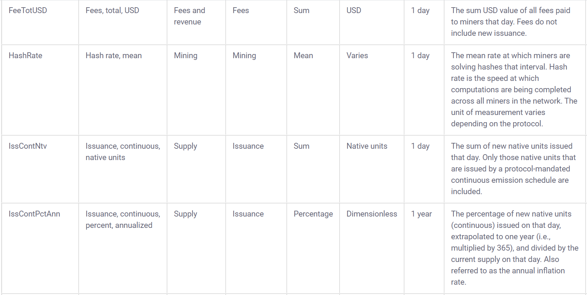
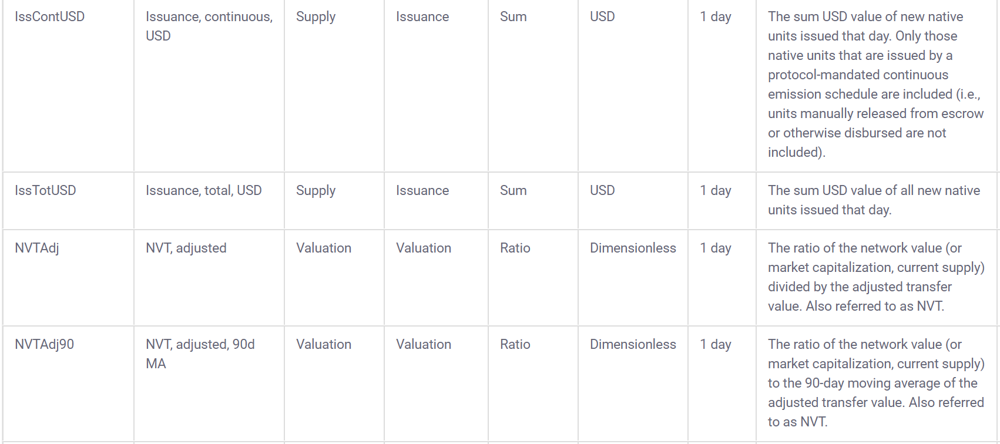
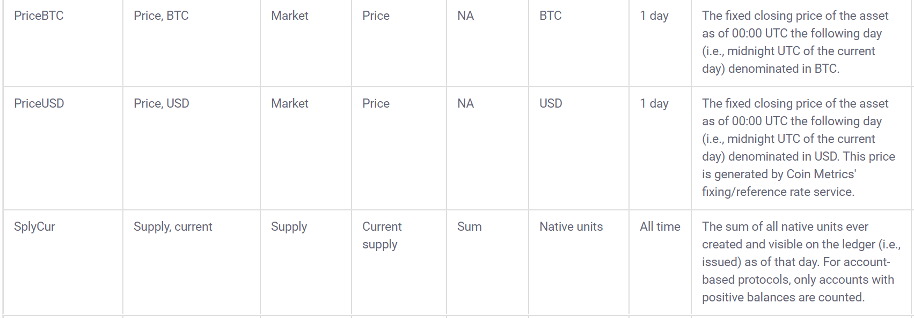
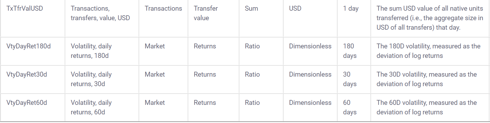

--- 
title: "RStudio 2020 Internship Application"
author: "Riccardo Esclapon"
site: bookdown::bookdown_site
documentclass: book
bibliography: [book.bib, packages.bib, main.bib]
biblio-style: apalike
link-citations: yes
description: "This is Ricky's application to the 2020 RStudio Internship."
---


# Overview

Video intro here


https://education.rstudio.com/blog/2020/02/applications-for-2020-intern-program-are-now-open/

APPLICATIONS END ON MARCH 5TH BE SURE TO APPLY BEFORE THEN!!

For video:

Start off with overview of projects I am suited for showing work I did for this application specifically. Then go on to talk about ways I have applied the broad RMarkdown ecosystem and automation in my work. Then talk a bit more about myself. Talk about ideal tutorial overview and close things by mentioning cool charts/visualizations section (outline this at a high level under 2 minutes in the video at the start here)


```{r include=FALSE}
# automatically create a bib database for R packages
knitr::write_bib(c(
  .packages(), "bookdown", "knitr", "rmarkdown", "tidyverse", "plotly", "rayshader"
), "packages.bib")
```

<!--chapter:end:index.Rmd-->

# What makes me a good fit {#fit}

Here are some of the things I believe make me a great fit for the internship:

## I `r emo::ji("heart")` .Rmd files

I was completely blown away by the R Markdown file format when I first discovered it, and I definitely felt like the courses I took in college in R should have mentioned the .Rmd format, as well as the tidyverse and the idea behind the pipe operator. I have spent a lot of my time learning R Markdown and digging through books and amazing resources made available by RStudio, so here are some of my favorite output formats that I am looking to teach people about:


### Learnr {#learnr}

<!-- I first discovered the ***learnr*** [@R-learnr] package in late 2018 and was really impressed by the functionality it provides. My first real project using learnr was centered around teaching my young Italian cousins to program in R by allowing them to compare their Fortnite stats in real time to each other and the best players in the world, and be able to learn more about the game through working with data, for example finding the best weapon based on their damage and range. The GitHub repository associated with that project can be found here: https://github.com/ries9112/R-Tutorial (the apps themselves are down but the repo has some gifs illustrating the past functionality) -->

I have been using learnr [for about a year and a half](https://github.com/ries9112/R-Tutorial), and recently I started to offer programming tutorials on my website using learnr where every time the tutorial is opened, users learn to program in R using data from the cryptocurrency markets that is never outdated by more than 1 hour:

(this takes about 30 seconds to load, give it more time if it's showing up blank)

```{r echo=F, fig.width=900}
knitr::include_app("https://predictcrypto.shinyapps.io/R_Basics/",
  height = "612E00px")
```

I would recommend looking at the **Visualization** section to visually see that the data is never outdated by more than 1 hour.

I post these on my website:
```{r, echo=F}
knitr::include_url("https://predictcrypto.com/tutorials",
  height = "600px")
```

I'm loving the integrated tutorials tab within RStudio in the 1.3 preview and I am working towards including these with my `PredictCrypto` package, which I talk more about and use in the [next section](#ideal-projects) of this document.


### Bookdown {#bookdown}

I was very close to paying for a monthly subscription on gitbook.com because I thought it was such an amazing format to provide documentation through, so I was particularly impressed by and grateful for the bookdown [@R-bookdown] package, and these days it's my go to for organizing most things I work on, so why not my application?

This document is obviously an example of a bookdown document in itself, but here's another guide I put together using bookdown:

```{r echo=F, fig.width=850}
knitr::include_url("https://predictcryptodb-quickstart.com/")
```

This guide refreshes daily in order to show a preview of the latest data within the document [and you can look at the GitHub Actions daily runs here](https://github.com/ries9112/PredictCryptoDB/actions). You can also see the refreshed data in the [*useful tables* section](https://predictcryptodb-quickstart.com/useful-tables.html) of the document.

I also found that documentation done in bookdown can work really great when working within a large company as well, and I put together some very thorough documentation for a project using bookdown that was very well received (but I can't show here). In my particular case it worked really well because I could send the link to the html index of the bookdown document and when opened it would behave like a website hosted on the shared folders within the secure network which ended up being particularly simple and effective.


### Presentations {#presentations}

I am a **big** fan of ioslides and revealjs in particular as R Markdown outputs. I find the revealjs output to be incredibly cool with the rotating cube animation, and the ability to not only move forward but move downward adds a surprisingly useful tool to break down topics; ioslides is just really clean, well made and easy to use and looks great with widescreen enabled. I aspire to be an expert in Xaringan one day but am not currently.

Making presentations in R Markdown is what really got me working with .Rmd files, because I started working towards a very specific project using an idea I haven't really seen elsewhere of creating presentations that give the user options and as they make their way through the slides, those options affect not only what they see in the slides that come afterwards, but also the options they are given. For example, the user could choose to do an analysis for a particular asset, then choose the main category of the analysis to perform, then the sub-category of the analysis and so on, until by the end of the presentation the user has performed an analysis that was completely unique and tailored to their preferences and interests. See the gif below for an example of what this looks like:

<!--  -->


### Blogdown {#blogdown}

Blogdown[@R-blogdown] and bookdown work very similarly, so most of what I mentioned in the [bookdown section](#bookdown) applies here. Because my website predictcrypto.com only shows the latest data based on the current date, I leverage blogdown to create weekly snapshots of the visualizations over the last 7 day period: https://predictcryptoblog.com/. 

```{r echo=F, fig.height=750}
knitr::include_url("https://predictcryptoblog.com/")
```

Because all these systems work so well with automation, as I keep adding new interesting content to my website I can also add archives of that content using blogdown.

### Pagedown {#pagedown}

Pagedown[@R-pagedown] is yet another awesome way to create html outputs and I used Nick Strayer's repository https://github.com/nstrayer/cv to build my cv and resume using his template:

```{r echo=F, fig.width=900}
knitr::include_url("https://ricky-cv.netlify.com/")
```


### Flexdashboard {#flexdashboard}

Flexdashboards[@R-flexdashboard] were my first introduction to shiny apps and I was completely blown away by that framework and have used it for several projects and is one of my absolute favorite tools.

To get some practice, I converted some of the content found in [Tidy Text Mining by Julia Silge and David Robinson](https://www.tidytextmining.com/) and made it into a flexdashboard. **I made no changes to the code found within the book**, this was simply an experiment to learn more about flexdashboards and semantic analysis:

```{r, echo=F}
knitr::include_url("https://predictcrypto.shinyapps.io/SemanticAnalysisExample/")
```

<!-- I made the code available through RStudio Cloud here as well: https://rstudio.cloud/spaces/9369/join?access_code=pkfhGuOMRhleNIHSHH6YOQPEWstEdg0e7Pi6Ue3q -->


## Automation {#automation}

Automation is at the center of everything I do and my one true passion. One of my big goals for RStudio::conf 2020 was to learn more about automating things through GitHub using CI since I always had a hard time figuring that out, and the things I learned about especially relating to GitHub actions and using Netlify were above my expectations in terms of the ease of use, capabilities and free tier offerings, and I am super excited to share how crazy simple automating a very complex process can be through RStudio, GitHub Actions and Netlify. I didn't fnd a huge wealth of information on automating things in R through GitHub Actions and I'm excited to share those learnings in the months to come.


It's pretty mindblowing that these frameworks allow a user to create an interactive book with complex javascript, HTML, CSS, TeX, etc... from scratch, deploy it to an https secured website and create an automated process around it, all in less than 10 minutes with minimal code involved. What's even more mindblowing, is that the same methodologies can be applied to make other interfaces, like making a blogdown website, and I can't speak highly enough of all the work Yihui blessed us all with.


## Fit Within the Company {#rstudio}

I really wanted to go to RStudio::conf 2019 but was not able to make it out and after all the videos got posted I watched most of them and immediately knew I had to come to RStudio::conf 2020 and it was a truly incredible experience.

JJ's talk and BCorp announcement really resonated with me and there is no other company who's mission I agree with more and I would always do my very best in carrying forward those values. I fundamentally believe the most straightforward way to success is to help other people succeed, and I love the values that RStudio holds dear as a company and there is really no other company that I want to work for more than RStudio.


<!-- I'm a big fan of the RStudio internship program. I applied last year too, and it was really awesome seeing Maya do such a great job on her tidyblocks project  -->


<!-- I tried really hard to not be too much of a fanboy at the conference, but I couldn't help but get a picture with JJ and Hadley.  -->

<!--  -->

<!--  -->


<!-- Would have loved one with Yihui as well, so I will try and get one with him at next year's conference if I get the chance -->


<!--chapter:end:01-WhyMe.Rmd-->

# Projects Well Suited For {#ideal-projects}


## Create resources for people working with spreadsheets in R


What better way to show I am suited for a project than to give a hands-on example? See the code below for a use-case using `googlesheets4`[@R-googlesheets4]. 

First I will go ahead and import every package in the `tidyverse`[@R-tidyverse]:
```{r import_tidyverse}
library(tidyverse)
```


Next let's import the `googlesheets4` and read a spreadsheet I made for this internship application, specifying the sheet called *coinmetrics_btc_eth* inside the function `read_sheet()`:

```{r import_coinmetrics_btc_eth, message=FALSE, warning=FALSE}
spreadsheet_url <- "https://docs.google.com/spreadsheets/d/1_zRBFrB1au7qhxuDDfDuh_bPLGd6RLrwOL5oQ3sBBX4/edit?usp=sharing"
library(googlesheets4)
googlesheets_data <- read_sheet(spreadsheet_url, sheet = 'coinmetrics_btc_eth') %>% as.data.frame()
```

Let's take a peek at the `datatable()` using `DT` [@R-DT]
```{r show_googlesheets_data}
library(DT)
datatable(googlesheets_data,  style = "default", 
          options = list(scrollX = TRUE, pageLength=5,dom='t'), rownames = F)
```

**This data is sourced from the website [coinmetrics.io](https://coinmetrics.io/community-network-data/#comm-files)**

[Coinmetrics also provides a data dictionary to go along with the data:](https://coinmetrics.io/community-data-dictionary/)










### Predictive Model - Data Prep

Using the data from coinmetrics, I will create a predictive model to forecast the percentage change in price over time in order to show that I would be a good fit for the first two projects listed.


First, I will import a package that I am making that is **still in development** `PredictCrypto`:

```{r library_predict_crypto}
library(PredictCrypto)
```
(this is an in-development tool that I will use for a research paper I am working on)

I attended the two day building tidy tools workshop working with Charlotte and Hadley at RStudio::conf 2020 and I am comfortable writing packages in R as well as using testthat and showing code coverage for a repository.

Here is the GitHub Pages environment associated with the repository: https://ries9112.github.io/PredictCrypto/

```{r show_github_pages, echo=F}
knitr::include_url("https://ries9112.github.io/PredictCrypto/")
```

I am going to convert the column names from ***CamelCase*** to ***snake_case*** using the `janitor`[@R-janitor] package because the functions in my package use snake_case and I want to avoid mixing the two:  

Before:
```{r print_before_colnames, echo=F}
colnames(googlesheets_data)
```

```{r janitor_clean_names, message=FALSE, warning=FALSE}
library(janitor)
googlesheets_data <- clean_names(googlesheets_data)
```

After:
```{r print_after_colnames, echo=F}
colnames(googlesheets_data)
```


Now that I imported the `PredictCrypto` package and the data is in snake_case, I can use the function `calculate_percent_change()` to create the target variable to predict. Before I can do that however, I need one more adjustment to the date/time fields, so let's do that using the `anytime`[@R-anytime] package:

```{r conversions_anytime}
library(anytime)
googlesheets_data$date <- anytime(googlesheets_data$date)
googlesheets_data$date_time_utc <- anytime(googlesheets_data$date_time_utc)
```


Now I can use the function `calculate_percent_change()` to calculate the % change of the price of each cryptocurrency and add a new column ***target_percent_change*** to each row, which will represent the percentage change in price for the 7 day period that came after that data point was collected:
```{r calculate_percent_change_function, warning=FALSE}
exercise_data <- PredictCrypto::calculate_percent_change(googlesheets_data, 7, 'days')
```

Let's take a peek at the new field:
```{r}
tail(exercise_data$target_percent_change, 10)
```

I could easily change this to a 14 day period:

```{r target_14d}
calculate_percent_change(googlesheets_data, 14, 'days') %>% tail(10) %>% select(target_percent_change)
```

Or a 24 hour period:

```{r target_24h}
calculate_percent_change(googlesheets_data, 24, 'hours') %>% tail(10) %>% select(target_percent_change)
```

<!-- 
note to self: taking the tail here because of join exclusion and sorting which would compare different data points using head() 
-->

Let's also scale the variables


ADD FEATURE SCALING HERE


## Build interactive learnr tutorials for tidymodels

https://education.rstudio.com/blog/2020/02/conf20-intro-ml/

https://conf20-intro-ml.netlify.com/materials/01-predicting/

***Disclaimer***:**Most of the code to follow was built using the content made available by Allison Hill from the RStudio::conf2020 intro to machine learning workshop and was not code I was familiar with before writing it for this internship application.**

### Create the `parsnip` [@R-parsnip] model

```{r parsnip models}
library(parsnip)
lm_model <- linear_reg() %>%              
  set_engine("lm") %>%             
  set_mode("regression")
```

List of models to refer to: https://tidymodels.github.io/parsnip/articles/articles/Models.html

Random Forest:
```{r}
random_forest_model <- rand_forest(trees = 100, mode = "regression") %>%
  set_engine("randomForest") 
```


XGBoost:
```{r}
xgboost_model <- xgboost_parsnip <- boost_tree() %>% 
  set_engine("xgboost") %>%             
  set_mode("regression")
```

Remove fields not used for models (NOTE: REMOVE price_usd_x_daysLater AND date_time_x_days_Later FROM BEING GENERATED INSIDE THE FUNCTION)

```{r}
exercise_data <- select(exercise_data, -date_time_utc, -date_time, -pkDummy, -pkey, -price_usd_x_daysLater, -date_time_x_daysLater)
```


Create train/test split using `rsample`[@R-rsample]:

(should I do 10-fold cross validation?)
```{r}
library(rsample)

set.seed(250)
crypto_data <- initial_split(exercise_data, prop = 0.8)
crypto_train <- training(crypto_data)
crypto_test  <-  testing(crypto_data)
```


### Train/fit the model:

```{r}
library(modelr)
lm_fitted <- lm_model %>% fit(price_usd ~ ., data=crypto_train)
```

Random Forest:
```{r}
random_forest_fitted <- random_forest_model %>%
  fit(target_percent_change ~ ., data = exercise_data)
```


XGBoost:

```{r}
xgboost_fitted <- xgboost_model %>% fit(price_usd ~ ., data=crypto_train)
```


Use the trained model to make predictions on test data:

```{r}
library(tidymodels)
lm_predictions <- lm_fitted %>% predict(crypto_test)
```

<!-- ```{r} -->
<!-- random_forest_predictions <- random_forest_fitted %>% predict(crypto_test) -->
<!-- ``` -->

```{r message=FALSE, warning=FALSE}
xgboost_predictions <- xgboost_fitted %>% predict(crypto_test)
```

Join the full dataset back to the predictions:

```{r}
lm_predictions <- lm_predictions %>% bind_cols(crypto_test)

xgboost_predictions <- xgboost_predictions %>% bind_cols(crypto_test)
```


Get metrics:
```{r}
lm_predictions %>%
  metrics(truth = target_percent_change, estimate = .pred)

xgboost_predictions %>%
  metrics(truth = target_percent_change, estimate = .pred)
```


### Now make one model for each cryptocurrency. 

***Code adapted from: https://r4ds.had.co.nz/many-models.html***

First I group the data

```{r group_nest_data}
crypto_data_grouped <- exercise_data %>% group_by(symbol) %>% nest()
```

```{r show_grouped_nested_data}
crypto_data_grouped
```

Make a helper function with the model:

```{r modelFunction}
grouped_linear_model <- function(df) {
  lm(target_percent_change ~ ., data = df)
}
```

Now we can use `purrr`[@R-purrr] to apply the model to each element of the grouped dataframe:
```{r}
grouped_models <- map(crypto_data_grouped$data, grouped_linear_model)
```


The models can be added into the dataframe as nested lists. We can also add the corresponding residuals:
```{r message=FALSE, warning=FALSE}
crypto_data_grouped <- crypto_data_grouped %>% 
  mutate(model=map(data,grouped_linear_model)) %>% 
  mutate(resids = map2(data, model, add_residuals))
```

Let's look at the object again:
```{r}
crypto_data_grouped
```


Let's unnest the residuals to take a closer look:

```{r}
resids <- unnest(crypto_data_grouped, resids)
```

```{r message=FALSE, warning=FALSE}
resids %>% 
  ggplot(aes(date, resid)) +
    geom_line(aes(group = symbol), alpha = 1 / 3) + 
    geom_smooth(se = FALSE) +
    ylim(c(-20,20)) +
    facet_wrap(~symbol)
```

### Add error metrics using `broom` [@R-broom]:

```{r broom_metrics_all}
crypto_models_metrics <- crypto_data_grouped %>% mutate(metrics=map(model,broom::glance)) %>% unnest(metrics)
```


Sort by the best scores:
```{r}
crypto_models_metrics %>% arrange(-r.squared)
```


### How much better do the models get if we add more variables?

Add MA, EMA, etc...


### Next Steps:

I won't go further than this here, but as my next steps, here is what I would do:

1. Use parsnip + purrr to iterate through lots of predictive models

2. How much better do the models get with hyperparameter tuning?

3. Visualize the best model before and after parameter tuning and then do the same with the worst performing model


<!-- Could also use `yardstick` [@R-yardstick] for metrics: https://tidymodels.github.io/yardstick/ -->

<!-- ```{r} -->
<!-- library(yardstick) -->
<!-- metrics(lm_predictions, target_percent_change,  estimate = .pred) -->
<!-- ``` -->


## Build interactive learnr tutorials for Python using reticulate

I think I could be a great fit for the third project listed related to creating learnr tutorials for Python using reticulate. I have a fair amount of experience in Python, but it's never really clicked very much for as much as R in the past, and I am looking to step-up my Python skills. My Master's in Data Science will work with Python a lot, and people immediately ask if I make tutorials in Python when I show them the R tutorials I have made, so this would be a great one for me to work on. I am also constantly told that Python is better than R for the incorrect reasons, and being more of an expert in Python would certainly help me debunk that myth when someone makes that argument.

I am very familiar with the `reticulate` package and I have used it in the past in an RMarkdown file to make automated cryptocurrency trades through a Python package `shrimpy-python`, which worked really well: https://github.com/shrimpy-dev/shrimpy-python

Since I have already demonstrated my familiarity with learnr tutorials **[in the previous section](#learnr)**, I will keep going with the code from the tidymodels project example I just finished and use Python for ... ADD GOAL HERE ...


DEV:

Replace this with the Python one:

<!-- ```{r} -->
<!-- knitr::include_app("https://predictcrypto.shinyapps.io/R_Basics/") -->
<!-- ``` -->

Could make a very simple xgboost model maybe?

Could also show using Shrimpy API to pull latest data, manipulate in pandas and visualize

Mention experience/courses taken in Python and how it's never clicked with me very much but how I am taking a basic Python course in my Master's in Data Science and I am looking to take it as an opportunity to create a lot of content using reticulate.

```{r import_reticulate}
library(reticulate)
```

```{python}

```


<!--chapter:end:02-ProjectsSuitedFor.Rmd-->

# About Me


<!--chapter:end:03-AboutMe.Rmd-->

# Ideal Tutorial


<!--chapter:end:04-IdealTutorial.Rmd-->

# Cool Charts 

## Disable while working on bookdown, takes too long to render!

Here are some examples of charts, which refresh daily using GitHub actions and Netlify for automation.


```{r setup, message=F, echo=F, include=FALSE}
# global.R to import libraries or error on shinyapps for some reason
library(shiny)
library(DBI)
library(RMySQL)
library(anytime)
library(ggthemes)
library(plotly)
library(lubridate)
library(tidyverse)
library(data.table)
library(stringr)
library(DT)
library(ggmap)
library(rayshader)
# library(ggstatsplot)
library(bibtex)
# To resolve issue with BioConductor package needed for ggstatsplot:
# if (!requireNamespace("BiocManager", quietly = TRUE))
#     install.packages("BiocManager")
# BiocManager::install()
#library(BiocManager)
# options(repos = BiocManager::repositories())
# options(repos = BiocInstaller::biocinstallRepos())
############# SQL CONNECTION ###############
source("login_info.R")
getSqlConnection <- function(){
  con <-
    dbConnect(
      RMySQL::MySQL(),
      username = Sys.getenv('user'),
      password = Sys.getenv('pswd'),
      host = Sys.getenv('ipAddress'),
      dbname = 'ScrapeStorm'
    )
  return(con)
}
database_connection <- getSqlConnection()
tables_list <- dbListTables(database_connection)
#Set knitr options for all chunks to remove annoying warnings
knitr::opts_chunk$set(warning=F)
query <- "SELECT Date as 'DateExtracted', DateTime as 'DateTimeUTC', Name, Rank, PriceUSD, PriceBTC, PercChange24hVsUSD, PercChange24hVsBTC, Reported_MarketCap, Reported24hVolume, VolumeTurnover24h, Reported_Supply, CurrentInflation, ATH_USD, TimeFromATH, PercDownFromATH, BreakevenMultiple, PercUpSinceLow, PercChange7d, PercChange7d_BTC, PercChange30d, PercChange30d_BTC, PercChange90d, PercChange90d_BTC, PercChange1y,PercChange1y_BTC, PercChange_MTD, PercChange_QTD, PercChange_YTD, NetworkPercStaking, FlipsideFCAS_Grade, FlipsideFCAS_Rating, FlipsideScore_Dev, FlipsideScore_Utility, FlipsideScore_Maturity, TokenInsight_Grade, TokenInsight_TeamScore, TokenInsight_SubjectScore, TxVol24h, AdjstedTxVol24h, MedianTxValueUSD, ActiveAddresses, Transactions24h, Fees24hUSD, MedianFeeUSD, AvgDifficulty, KilobytesAdded24h, NumBlocks24h, Git_Stars, Git_Watchers, Git_CommitsLast90Days, Git_CommitsLastYear, Git_LinesAddedLast90Days, Git_LinesAddedLastYear, Git_LinesRemovedLast90Days, Git_LinesRemovedLastYear, ROI_2018, ROI_2017, ROI_2016, Volatility30d, Volatility90d, Volatility1y, Volatility3y, Sharpe30d, Sharpe90d, Sharpe1y, Sharpe3y, BlockReward, TargetBlockTimeSeconds, OnChainGovernanceStructure, IsTreasuryDecentralized, LaunchStyle, MiningAlgorithm, NextHalvingDate, GenesisBlockDate, Age, HasExperienced51PercAttack, EmissionType_General, EmissionType_Precise, IsSupplyCapped, MaxSupply, Sector, Category, TokenUsage, TokenType, ConsensusAlgorithm, pkDummy FROM Messari WHERE Date >= date_sub(now(), INTERVAL 7 DAY) AND Name != '' order by pkDummy desc, cast(Rank as unsigned) asc" #Manually picked all fields that could be interesting for this + Use Case tutorial
cryptoData <- dbFetch(dbSendQuery(database_connection, query), 250000)
#Write data to .csv and read it in to automatically adjust all data types from strings
write.csv(cryptoData, 'cryptoData.csv')
cryptoData <- read.csv('cryptoData.csv', stringsAsFactors = F)
#Convert Date and DateTime fields
cryptoData$DateExtracted <- anytime(cryptoData$DateExtracted)
cryptoData$DateTimeUTC <- anytime(cryptoData$DateTimeUTC)
#Remove scientific notation
options(scipen=999)
#Convert rank to numeric
cryptoData$Rank <- as.numeric(cryptoData$Rank)
#Remove data with NA PriceUSD field - Haven't done it but might be good to do to avoid issues with things like calculating means
##### CREATE ALL GLOBAL OBJECTS USED THROUGHOUT THE TUTORIAL HERE TO AVOID ISSUES
#It's also good to remember that before uploading app should Source code, clear cache and ALWAYS press on the "start over" button before uploading to avoid issue with continue button not working
#Create a custom function to create % change target over "X" hours
calculateChange <- function(df, enterHours){
  dfHLater <- df
  #exclude most recent 12 hours since they wouldn't have data
  #df12hLater_new <- filter(dfHLater, DateTimeUTC <= max(df$DateTimeUTC) - hours(12) )
  dfHLater$DateTimeUTC <- dfHLater$DateTimeUTC - hours(enterHours)
  #Replace pkDummy
  dfHLater$pkDummy <-substr(dfHLater$DateTimeUTC, 1, 13)
  df$pkDummy <-substr(df$DateTimeUTC, 1, 13)
  #Create both pkeys
  df$pkey <- paste0(df$pkDummy,df$Name)
  dfHLater$pkey <- paste0(dfHLater$pkDummy,dfHLater$Name)
  #Re-adjust the 12hLater time
  dfHLater$DateTimeUTC <- dfHLater$DateTimeUTC + hours(enterHours)
  #narrow down new dataframe to just the Price
  dfHLater <- select(dfHLater, PriceUSD, pkey, DateTimeUTC) %>% rename(PriceUSD_XhoursLater = PriceUSD, DateTimeUTC_XhoursLater = DateTimeUTC)
  #join data
  joinedDataset <- left_join(df, dfHLater, by='pkey')
  joinedDataset <- filter(joinedDataset, DateTimeUTC <= max(df$DateTimeUTC) - hours(enterHours) )
  #Now calculate % change
  joinedDataset$TargetPercChange <- ((joinedDataset$PriceUSD_XhoursLater-joinedDataset$PriceUSD) / joinedDataset$PriceUSD) * 100
  return(joinedDataset)
}
#### IMPORTANT NOTE FOR CODE ABOVE. RATHER THAN HAVING "XhoursLater", find a way to concat the string of the field name with the user input enterHours! Important, do it before tutorial is too far along!
#Remove first column of the data "X"
cryptoData <- select(cryptoData,-1)
########## DATA SELECTION #############
#Create df with different % calculated
targetData <- calculateChange(cryptoData,6)
targetData12 <- calculateChange(cryptoData,12)
targetData24 <- calculateChange(cryptoData,24)
# Pull KuCoin Exchange data
query <- "SELECT * FROM ScrapeStorm.ShrimpyPrices WHERE Date >= date_sub(now(), INTERVAL 7 DAY) ORDER BY pkDummy DESC"
shrimpyData <- dbFetch(dbSendQuery(database_connection, query), 250000)
# Rename DateTime to DateTimeUTC
shrimpyData <- rename(shrimpyData, DateTimeUTC = DateTime)
# After adjusting fields could also easily get the % change on KuCoinData:
shrimpyData$PriceUSD <- as.numeric(shrimpyData$Price)
shrimpyData$DateTimeUTC <- anytime(shrimpyData$DateTimeUTC)
shrimpyData <- calculateChange(shrimpyData,12)
#Filter down to Ethereum data
ethereumData <- filter(cryptoData, Name == 'Ethereum')
```


<!-- ## Previous 24h % Change - Global Market - Hex Bins -->

<!-- The y-axis in the chart below is limited to a range of -25% to 25% -->

<!-- ```{r rayshader, echo=FALSE, message=FALSE, warning=FALSE} -->
<!-- filename_movie = 'rayshader.mp4' -->
<!-- phivechalf = 30 + 60 * 1/(1 + exp(seq(-7, 20, length.out = 180)/2)) -->
<!-- phivecfull = c(phivechalf, rev(phivechalf)) -->
<!-- thetavec = -90 + 45 * sin(seq(0,359,length.out = 360) * pi/180) -->
<!-- zoomvec = 0.45 + 0.2 * 1/(1 + exp(seq(-5, 20, length.out = 180))) -->
<!-- zoomvecfull = c(zoomvec, rev(zoomvec)) -->

<!-- plot_gg(ggplot(data = cryptoData, aes(x=DateTimeUTC, y=PercChange24hVsUSD)) + -->
<!--           geom_hex() + -->
<!--           ylim(-25,25) + -->
<!--           scale_fill_gradient(low="white", high="blue")) #adjust the color of this chart -->


<!-- render_movie(filename = filename_movie, type = "custom", -->
<!--              frames = 360,  phi = phivecfull, zoom = zoomvecfull, theta = thetavec) -->
<!-- rgl::rgl.close() -->
<!-- ``` -->

<!-- <video width="600" height="500" controls> -->
<!--   <source src="rayshader.mp4" type="video/mp4"> -->
<!-- </video> -->

<!-- <br /> -->


```{r disconnect_db, echo=F, message=F, warning=F}
# Disconnect from the database
dbDisconnect(database_connection)
```

<!--chapter:end:05-CoolCharts.Rmd-->

`r if (knitr::is_html_output()) '
# References {-}
'`

<!--chapter:end:06-references.Rmd-->

